# LỜI CẢM ƠN

Trong quá trình thực hiện đồ án tốt nghiệp này, em đã nhận được sự giúp đỡ tận tình của cán bộ hướng dẫn TS. Trần Trung – Giảng viên Khoa CNTT Trường Đại học Điện lực; cán bộ quản lý ThS. Nguyễn Đức Ngân – Giảng viên Khoa ATTT Học viện Kỹ thuật Mật Mã, cùng với sự quan tâm sâu sát của Hệ quản lý sinh viên, sự động viên của người thân và bạn bè.

Em xin chân thành cảm ơn!

# LỜI NÓI ĐẦU

Trong bối cảnh chuyển đổi số, số hóa hồ sơ và văn bằng giúp nâng cao hiệu quả quản lý nhưng đồng thời đặt ra yêu cầu về tính toàn vẹn, xác thực và khả năng truy vết. Đề tài “Nghiên cứu phát triển hệ thống thông tin hỗ trợ quản lý văn bằng chứng chỉ dựa trên nền tảng Blockchain” nghiên cứu cơ sở lý thuyết, phân tích thiết kế và triển khai thực nghiệm một hệ thống phát hành, quản lý, xác minh và thu hồi văn bằng số.

# CHƯƠNG I. CƠ SỞ LÝ THUYẾT VỀ CÔNG NGHỆ BLOCKCHAIN

## Tổng quan về công nghệ Blockchain

### Khái niệm và mục tiêu hình thành

Công nghệ chuỗi khối (Blockchain) là một dạng kiến trúc sổ cái phân tán (Distributed Ledger Technology - DLT), trong đó dữ liệu giao dịch được đóng gói thành các khối (blocks), liên kết tuần tự theo thời gian bằng các hàm băm mật mã và được đồng bộ giữa các nút mạng thông qua giao thức đồng thuận [1], [2]. Thay vì phụ thuộc vào một máy chủ trung tâm, sổ cái Blockchain được sao chép và duy trì độc lập tại nhiều nút tham gia. Khi dữ liệu quá khứ bị thay đổi, các liên kết băm phía sau không còn khớp; sự sai lệch vì thế có thể được phát hiện khi kiểm tra lại lịch sử. Kết hợp với sao chép sổ cái và đồng thuận, cơ chế này làm cho việc sửa đổi hồi tố mà không để lại dấu vết trở nên khó khăn trong các giả định an toàn của hệ thống [1], [10].

Mục tiêu cốt lõi của Blockchain là giúp các thực thể thuộc nhiều miền quản trị thống nhất một lịch sử trạng thái dùng chung và giảm mức phụ thuộc vào một bên trung gian duy nhất [1]. Trong các quy trình nghiệp vụ truyền thống, việc đối soát liên tổ chức qua trung gian thường làm phát sinh chi phí, độ trễ và nguy cơ xuất hiện điểm lỗi đơn lẻ (Single Point of Failure). Blockchain giải quyết bài toán này nhờ kết hợp mật mã khóa công khai, cây Merkle, mạng ngang hàng và thuật toán đồng thuận để tạo ra nhật ký kiểm toán minh bạch, cho phép các bên tự kiểm chứng tính toàn vẹn dữ liệu [2], [10].

Tuy nhiên, Blockchain không nhằm thay thế các hệ thống lưu trữ dung lượng lớn hay cơ sở dữ liệu quan hệ truyền thống. Mọi hệ thống Blockchain trong thực tế đều đòi hỏi một khung quản trị xác định, bao gồm quy định về quyền truy cập, chính sách quản lý khóa mật mã, quy tắc phê duyệt giao dịch và cơ chế nâng cấp giao thức [1]. Công nghệ này phù hợp hơn với bài toán cộng tác đa bên, trong đó các thực thể cần chia sẻ trạng thái có thể kiểm chứng nhưng không muốn một bên duy nhất toàn quyền quyết định lịch sử dữ liệu [10].

### Quá trình phát triển

Nền tảng lý thuyết của Blockchain là kết quả kế thừa từ nhiều thập kỷ nghiên cứu về mật mã học, cấu trúc dữ liệu và hệ thống phân tán. Từ cuối những năm 1970 và đầu thập niên 1980, các công trình về hệ mật mã khóa công khai, cấu trúc cây băm Merkle [3] và các giải pháp đóng dấu thời gian số (digital timestamping) đã đặt nền móng cho việc xác thực tính toàn vẹn dữ liệu. Song song với đó, lý thuyết hệ thống phân tán phát triển các mô hình đồng thuận chịu lỗi dừng (CFT) và chịu lỗi tùy ý Byzantine (BFT), cung cấp cơ sở toán học để duy trì tính nhất quán trạng thái giữa các nút độc lập khi xảy ra sự cố mạng hoặc có nút sai hỏng [6], [7].

Năm 2008, Satoshi Nakamoto kết hợp chuỗi liên kết băm, mạng ngang hàng và cơ chế Bằng chứng công việc (Proof of Work) để giới thiệu Bitcoin, qua đó đề xuất một cơ chế hạn chế chi tiêu kép mà không cần máy chủ thanh toán trung tâm [1], [2]. Các nền tảng về sau mở rộng khả năng lập trình trạng thái thông qua hợp đồng thông minh (smart contract), cho phép biểu diễn và tự động thực thi một số quy tắc nghiệp vụ [1], [10]. Đồng thời, các kiến trúc Blockchain cấp quyền (permissioned) ra đời, ứng dụng các thuật toán CFT và BFT để tối ưu hóa thông lượng và đáp ứng yêu cầu bảo mật, quyền riêng tư nghiêm ngặt trong môi trường liên tổ chức [1], [8].

### Đặc trưng, giới hạn và những cách hiểu cần tránh

Hệ thống Blockchain sở hữu các đặc trưng kỹ thuật cốt lõi gồm phân tán dữ liệu, khả năng kiểm chứng độc lập, tính truy vết giao dịch và cơ chế chống can thiệp dữ liệu hồi tố [1]. Mọi giao dịch hợp lệ đều gắn liền với định danh mật mã của bên khởi tạo và được neo chặt vào cấu trúc chuỗi khối, giúp người tham gia đối soát lịch sử một cách minh bạch mà không phụ thuộc một chủ thể duy nhất [2], [10]. Mặc dù vậy, việc nghiên cứu và ứng dụng đòi hỏi phải nhận diện rõ các giới hạn kỹ thuật và tránh ba ngộ nhận phổ biến:

Thứ nhất, dữ liệu ghi trên chuỗi không đồng nghĩa với chân lý thực tế; hệ thống chỉ bảo đảm tính toàn vẹn của dữ liệu sau khi đã được chấp nhận vào sổ cái. Nếu dữ liệu đầu vào bị sai lệch hoặc cố tình gian lận từ khâu thu thập ngoại chuỗi (off-chain), hệ thống vẫn lưu trữ và bảo vệ dữ liệu sai đó một cách bền vững theo nguyên lý "rác vào, rác ra" (Garbage-In, Garbage-Out) [1]. Thứ hai, không nên tuyệt đối hóa tính chất dữ liệu thành "bất biến vĩnh cửu". Về bản chất, dữ liệu trên chuỗi chỉ mang tính kháng sửa đổi dựa trên các giả định an toàn mật mã và ngưỡng tài nguyên đồng thuận; nếu kẻ xấu kiểm soát vượt ngưỡng năng lực tính toán hoặc vượt số nút lỗi cho phép của thuật toán đồng thuận, lịch sử giao dịch vẫn có nguy cơ bị phân nhánh hoặc đảo ngược [1], [6].

Thứ ba, Blockchain không đồng nghĩa với tính ẩn danh hoàn toàn hay việc loại bỏ trách nhiệm pháp lý. Đa phần các mạng lưới chỉ cung cấp tính năng bí danh (pseudonymity) dựa trên địa chỉ khóa công khai; thông qua phân tích đồ thị luồng giao dịch và đối chiếu siêu dữ liệu ngoại vi, danh tính thực của thực thể vẫn có thể bị truy vết và định danh [1]. Ngoài ra, việc nhiều nút cùng kiểm tra và lưu bản sao thường làm tăng độ trễ, chi phí lưu trữ và chi phí phối hợp so với cơ sở dữ liệu tập trung được tối ưu cho cùng một bài toán [10].

### Phân biệt với DLT và cơ sở dữ liệu phân tán

Công nghệ sổ cái phân tán (DLT) là khái niệm bao trùm, chỉ chung mọi kiến trúc hệ thống lưu trữ và đồng bộ hóa sổ cái ghi chép trạng thái trên nhiều thực thể mạng mà không phụ thuộc vào một máy chủ trung tâm [1]. DLT không bắt buộc dữ liệu phải tổ chức thành khối liên kết chuỗi tuyến tính, mà có thể sử dụng cấu trúc đồ thị có hướng không chu trình (DAG) hoặc các dạng cây phi tuyến khác. Do đó, Blockchain là một tập con đặc thù của DLT, nổi bật với cấu trúc phân khối tuần tự và các liên kết mật mã chặt chẽ giữa các khối [1], [10].

Cơ sở dữ liệu phân tán truyền thống (chẳng hạn các hệ quản trị RDBMS hoặc NoSQL phân tán) cũng thực hiện việc phân mảnh và nhân bản dữ liệu qua nhiều máy chủ nhằm tối ưu thông lượng, độ sẵn sàng (Availability) và tính chịu lỗi phần cứng (Fault Tolerance). Tuy nhiên, các hệ thống này vận hành trong cùng một miền quản trị tin cậy (Single Trust Domain) dưới sự kiểm soát của một tổ chức [10]. Quản trị viên hệ thống (DBA) có toàn quyền can thiệp, xóa bản ghi hoặc chỉnh sửa lược đồ dữ liệu trực tiếp mà không cần sự đồng thuận ngang hàng của các bên độc lập.

Blockchain hướng tới môi trường có nhiều chủ thể cùng duy trì lịch sử theo một bộ quy tắc đã thống nhất [1], [8]. Trong thiết kế liên tổ chức, quyền cập nhật và quản trị nên được phân bổ sao cho một tài khoản đơn lẻ không thể âm thầm sửa lịch sử đã xác nhận; tuy nhiên, mức phân quyền thực tế vẫn phụ thuộc số tổ chức vận hành, chính sách nâng cấp và khả năng thông đồng. Khác biệt cốt lõi so với cơ sở dữ liệu phân tán truyền thống vì thế nằm ở ranh giới tin cậy và quy trình chấp nhận thay đổi, không chỉ ở số lượng máy lưu bản sao [10].

## Cấu trúc dữ liệu và nền tảng mật mã

### Giao dịch, khối và liên kết băm

Giao dịch (Transaction) là đơn vị nguyên tử biểu diễn một yêu cầu thay đổi trạng thái trong hệ thống sổ cái phân tán [1], [10]. Tùy nền tảng, giao dịch có thể chứa định danh hoặc địa chỉ bên gửi, dữ liệu đầu vào, số thứ tự chống phát lại, tham số phí và chữ ký số. Khi được phát tán vào mạng lưới, các nút tiếp nhận tiến hành kiểm tra độc lập tính hợp lệ về mặt cú pháp, tính toàn vẹn chữ ký số và điều kiện logic trạng thái hiện hành trước khi chấp nhận đưa vào hàng đợi xử lý [1], [2].

Các giao dịch đã được sắp thứ tự có thể được đóng gói vào Khối (Block), gồm phần đầu chứa siêu dữ liệu giao thức và phần thân chứa giao dịch [1], [2]. Tùy thiết kế, phần đầu khối có thể bao gồm giá trị băm của khối trước $H_{i-1}$, gốc Merkle $MerkleRoot_i$, dấu thời gian $Timestamp_i$ và dữ liệu phục vụ đồng thuận $Metadata_i$. Mối liên kết mật mã giữa các khối liên tiếp có thể được biểu diễn khái quát như sau:

$$H_i = H(H_{i-1} \parallel MerkleRoot_i \parallel Timestamp_i \parallel Metadata_i) 	ag{1.1}$$

Trong biểu thức (1.1), toán tử $\parallel$ biểu thị phép nối chuỗi. Đây là mô hình minh họa; tập trường và quy tắc mã hóa byte cụ thể do từng giao thức quy định. Giá trị $H_{i-1}$ tạo liên kết kiểm chứng giữa hai khối liên tiếp.

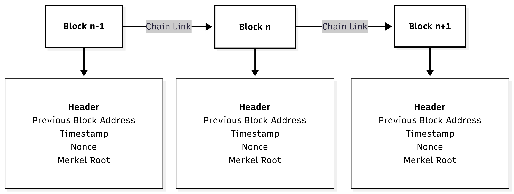

Hình 1.1. Cấu trúc khối và liên kết mật mã giữa các khối liên tiếp

Nếu dữ liệu trong khối quá khứ $k$ bị sửa, giá trị băm giao dịch, gốc Merkle và $H_k$ thay đổi do tính nhạy của hàm băm [4]. Tham chiếu tại khối kế tiếp vì thế không còn khớp và sự can thiệp có thể được phát hiện. Để lịch sử đã sửa được các nút chấp nhận, đối phương còn phải đáp ứng quy tắc đồng thuận và chính sách quản trị của mạng; điều kiện cụ thể phụ thuộc loại Blockchain và mô hình đe dọa, không chỉ phụ thuộc liên kết băm [1], [2].

### Hàm băm mật mã và cây Merkle

Hàm băm mật mã là công cụ toán học nền tảng để kiểm tra tính toàn vẹn dữ liệu trong kiến trúc chuỗi khối [1], [4]. Một hàm băm mật mã $H$ ánh xạ thông điệp $M$ có độ dài tùy ý thành chuỗi nhị phân cố định $h = H(M) \in \{0,1\}^{n}$; với SHA-256, $n=256$ [4]. Ba thuộc tính an toàn thường được xét gồm: kháng tiền ảnh (cho trước $y$, khó tìm $M$ sao cho $H(M)=y$), kháng tiền ảnh thứ hai (cho trước $M$, khó tìm $M^{\prime} \ne M$ sao cho $H(M^{\prime})=H(M)$) và kháng va chạm (khó tìm hai thông điệp phân biệt có cùng giá trị băm). Hiệu ứng tuyết lở làm cho thay đổi nhỏ ở đầu vào dẫn đến thay đổi lớn, khó dự đoán ở đầu ra [4].

Để quản lý và xác thực danh sách giao dịch trong khối với chi phí tối ưu, giao thức sử dụng cấu trúc Cây Merkle (Merkle Tree) [3]. Cây Merkle thường được biểu diễn dưới dạng cây băm nhị phân, trong đó mỗi nút lá lưu $L_j=H(Tx_j)$, còn mỗi nút trung gian được tính theo $N=H(N_L \parallel N_R)$. Tiến trình băm cặp này thực hiện đệ quy từ các nút lá lên đỉnh để tạo ra một giá trị đại diện duy nhất là Gốc Merkle (Merkle Root) được ghi vào phần đầu khối [3]. Cây nhị phân là mô hình minh họa phổ biến; cấu trúc và cách xử lý số nút lẻ có thể khác giữa các nền tảng.

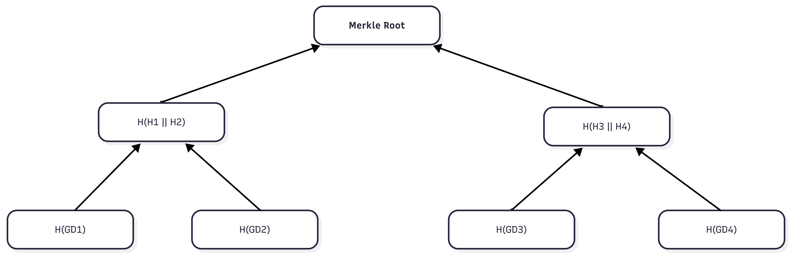

Hình 1.2. Cây Merkle và đường dẫn kiểm chứng một giao dịch

Cấu trúc cây Merkle cho phép kiểm tra một giao dịch thuộc tập giao dịch đã cam kết thông qua Bằng chứng Merkle (Merkle Proof). Với cây cân bằng, kích thước bằng chứng và số phép băm khi xác minh ở mức $O(\log n)$, với $n$ là tổng số giao dịch [3], [10]. Một nút nhẹ (Light Node) chỉ cần lưu trữ phần đầu khối chứa Merkle Root và yêu cầu mạng lưới cung cấp chuỗi các nút băm trung gian nằm dọc theo đường dẫn kiểm chứng (Audit Path) từ giao dịch cần kiểm tra lên gốc cây. Bằng cách thực hiện tối đa $\lceil \log_2 n \rceil$ phép băm đối với cây cân bằng, nút kiểm tra có thể tự xác thực tính hợp lệ của giao dịch mà không cần tải hay phân tích toàn bộ phần thân khối, giúp tối ưu hóa băng thông mạng và hiệu năng lưu trữ trong hệ thống phân tán [3], [10].

### Mật mã khóa công khai và chữ ký số

Mật mã khóa công khai và chữ ký số thiết lập cơ chế xác thực nguồn gốc và kiểm soát ủy quyền đối với các giao dịch thay đổi trạng thái sổ cái [1], [5]. Theo NIST FIPS 186-5 [5], một lược đồ chữ ký số có thể được mô tả hình thức qua ba thuật toán: $KeyGen$ sinh cặp khóa bí mật $sk$ và khóa công khai $pk$; $Sign$ tạo chữ ký $\sigma$ cho thông điệp $m$; $Verify$ kiểm tra chữ ký dựa trên $pk$ và $m$:

$$KeyGen(1^{\lambda}) \rightarrow (sk,pk); \quad \sigma = Sign(sk,m); \quad Verify(pk,m,\sigma) \in \{0,1\}. \tag{1.2}$$

Không nên diễn giải chữ ký số nói chung như việc "mã hóa giá trị băm bằng khóa bí mật rồi giải mã bằng khóa công khai". Cách mô tả này không phản ánh mô hình của nhiều lược đồ hiện đại. Ở mức tổng quát, thuật toán Verify chỉ trả về kết quả hợp lệ hoặc không hợp lệ dựa trên khóa công khai, thông điệp và chữ ký; nó không khôi phục thông điệp bằng một phép giải mã [5].

Về phương diện an toàn thông tin, chữ ký số cung cấp ba thuộc tính cơ bản: xác thực nguồn gốc (Authentication), bảo toàn tính toàn vẹn (Integrity) và chống chối bỏ kỹ thuật (Non-repudiation) [1], [5]. Tuy nhiên, cần nhận thức rõ giới hạn biên của công nghệ: chữ ký số chỉ chứng minh tính hợp lệ về mặt toán học giữa bộ dữ liệu (m, σ, pk), chứ không thể chứng minh thực thể hợp pháp thực sự trực tiếp ký nếu khóa bí mật sk đã bị lộ lọt, bị mã độc đánh cắp hoặc trích xuất trái phép từ thiết bị lưu trữ [1], [5]. Do đó, giá trị chứng minh của chữ ký trong thực tế phụ thuộc vào quản lý vòng đời khóa, bảo vệ thiết bị ký, gắn khóa với đúng danh tính, ghi nhật ký sử dụng và thu hồi kịp thời khi có sự cố [1], [5].

### Định danh, dấu thời gian và nonce

Định danh trong Blockchain cho phép gắn giao dịch với một khóa hoặc tư cách thành viên có quyền [1]. Ở mạng không cấp quyền, địa chỉ thường được tạo từ khóa công khai hoặc dữ liệu dẫn xuất và chủ yếu mang tính bí danh. Ở mạng cấp quyền, khóa công khai có thể được gắn với danh tính tổ chức thông qua chứng thư số và hạ tầng khóa công khai [8]. Trong cả hai trường hợp, chữ ký hợp lệ chỉ chứng minh việc sử dụng khóa tương ứng; mối liên hệ giữa khóa và cá nhân hoặc tổ chức ngoài đời vẫn phụ thuộc quy trình đăng ký, cấp phát và quản trị danh tính.

Dấu thời gian hỗ trợ sắp xếp sự kiện và áp dụng các quy tắc có yếu tố thời hạn, nhưng không nên mặc nhiên coi thời gian do một nút cung cấp là bằng chứng thời gian pháp lý. Mạng phân tán không có đồng hồ vật lý chung tuyệt đối; từng giao thức phải quy định nguồn thời gian, khoảng sai lệch chấp nhận và cách xử lý nút có đồng hồ sai [1], [2]. Khi nghiệp vụ cần bằng chứng thời gian có thẩm quyền, hệ thống phải kết hợp cơ chế xác nhận phù hợp ngoài Blockchain.

Nonce là giá trị được giao thức sử dụng để tạo tính duy nhất hoặc thứ tự. Trong PoW, nút khai thác thay đổi nonce để tìm giá trị băm thỏa điều kiện độ khó [2]. Trong mô hình tài khoản, nonce thường là bộ đếm tăng dần để các nút phát hiện giao dịch cũ hoặc sai thứ tự. Cơ chế này hỗ trợ chống phát lại khi được kiểm tra cùng chữ ký và ngữ cảnh giao dịch; nó không thay thế toàn bộ biện pháp bảo vệ phiên và giao thức [1], [10].

## Kiến trúc và nguyên lý hoạt động

### Mạng ngang hàng và vai trò của nút

Mạng ngang hàng (Peer-to-Peer - P2P) cho phép các nút trao đổi trực tiếp giao dịch, khối và thông tin trạng thái mà không bắt buộc mọi thông điệp phải đi qua một máy chủ trung tâm [1], [2]. Mỗi nút kiểm tra dữ liệu nhận được theo quy tắc giao thức trước khi chuyển tiếp cho các nút lân cận. Cách tổ chức này hỗ trợ nhân bản dữ liệu, tăng khả năng tiếp tục hoạt động khi một số kết nối gặp sự cố và làm giảm phụ thuộc vào một điểm truyền tin duy nhất. Tuy nhiên, P2P không đồng nghĩa với phân quyền tuyệt đối: các nút vẫn có thể tập trung tại cùng nhà cung cấp hạ tầng, cùng miền quản trị hoặc chịu ảnh hưởng của một nhóm vận hành nhỏ [1], [10].

Vai trò của nút phụ thuộc nền tảng. Nút đầy đủ thường lưu đủ dữ liệu cần thiết để tự kiểm tra lịch sử; nút nhẹ chỉ giữ một phần thông tin và dựa vào bằng chứng mật mã; nút đề xuất hoặc xác thực tham gia đồng thuận; một số nền tảng còn tách riêng nhiệm vụ sắp thứ tự, thực thi và lưu trữ [1], [8]. Vì vậy, các tên gọi như nút khai thác, nút xác thực hay nút lưu trữ không phải bộ phân loại áp dụng cho mọi Blockchain. Khi đánh giá kiến trúc, cần xác định rõ mỗi nút lưu gì, kiểm tra gì, thuộc tổ chức nào và có quyền tác động đến trạng thái ra sao.

### Vòng đời giao dịch

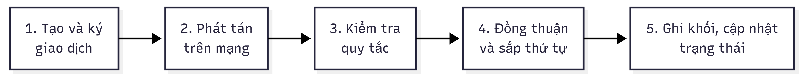

Hình 1.3. Vòng đời giao dịch Blockchain ở mức khái quát

Vòng đời giao dịch bắt đầu khi chủ thể tạo yêu cầu thay đổi trạng thái và ký bằng khóa bí mật tương ứng. Nút tiếp nhận kiểm tra cấu trúc, chữ ký, số thứ tự chống phát lại, quyền thao tác và điều kiện trạng thái hiện tại [1]. Giao dịch hợp lệ được truyền tới các thành phần tham gia sắp thứ tự hoặc đồng thuận. Trong mạng công khai, giao dịch có thể được giữ trong vùng chờ trước khi nút đề xuất lựa chọn; mạng cấp quyền có thể sử dụng quy trình đề xuất, chứng thực và sắp thứ tự khác mà không có hoạt động khai thác [2], [8].

Sau khi đạt điều kiện chấp nhận của giao thức, giao dịch được đưa vào khối hoặc lô dữ liệu, truyền tới các nút và kiểm tra lần cuối trước khi cập nhật trạng thái. Ứng dụng chỉ nên thông báo thành công khi đã nhận bằng chứng giao dịch được cam kết hợp lệ, thay vì coi việc tạo mã giao dịch hay phát tán yêu cầu là hoàn tất. Mức độ chắc chắn của kết quả phụ thuộc cơ chế đồng thuận: một số mạng cần nhiều khối xác nhận, trong khi mạng dựa trên túc số có thể đạt hoàn tất xác định dưới các giả định vận hành đã nêu [1], [6].

### Sao chép trạng thái và thực thi xác định

Blockchain có thể được phân tích như một dạng sao chép máy trạng thái. Gọi $S$ là trạng thái, $T$ là giao dịch và $\delta$ là hàm chuyển trạng thái; cùng trạng thái đầu vào và cùng thứ tự giao dịch phải tạo cùng kết quả $S^{\prime} = \delta(S,T)$ tại các nút trung thực [10]. Điều kiện xác định này đòi hỏi chương trình tránh phụ thuộc trực tiếp vào đồng hồ cục bộ, số ngẫu nhiên không được thống nhất, phản hồi mạng bên ngoài hoặc cách làm tròn khác nhau giữa các máy.

Nhiều nền tảng tách nhật ký giao dịch nối tiếp khỏi phần biểu diễn trạng thái mới nhất để vừa bảo toàn lịch sử vừa truy vấn hiệu quả. Nhật ký cho phép kiểm toán và tái dựng; trạng thái hiện thời phục vụ nghiệp vụ đọc thường xuyên. Đây là mô hình kiến trúc phổ biến nhưng cách tổ chức dữ liệu, xử lý giao dịch không hợp lệ và phục hồi trạng thái thay đổi theo từng nền tảng [8], [10].

### Hợp đồng thông minh và dữ liệu ngoài hệ thống

Hợp đồng thông minh là chương trình biểu diễn quy tắc chuyển trạng thái và được các nút thực thi theo cơ chế của nền tảng [1], [10]. Nó có thể chuẩn hóa điều kiện nghiệp vụ và tạo dấu vết nhất quán, nhưng không tự bảo đảm logic được viết đúng. Lỗi phân quyền, kiểm tra đầu vào, xử lý trạng thái hoặc cơ chế nâng cấp có thể gây hậu quả trên toàn mạng. Vì vậy, mã cần được kiểm thử, rà soát an toàn, quản lý phiên bản và triển khai theo quy trình phê duyệt phù hợp.

Môi trường thực thi xác định không thể tùy ý lấy dữ liệu từ Internet vì các nút có thể nhận kết quả khác nhau. Dữ liệu ngoài hệ thống thường được đưa vào qua nguồn cung cấp có thẩm quyền hoặc cơ chế oracle. Chữ ký của nguồn chỉ chứng minh dữ liệu đến từ khóa tương ứng và không bị sửa sau khi ký; nó không chứng minh nội dung phản ánh đúng sự thật ngoài đời. Thiết kế an toàn cần quy định nguồn tin cậy, thời hạn hiệu lực, cách xử lý sai lệch và cơ chế dừng an toàn khi dữ liệu ngoài không đáng tin [1].

## Cơ chế đồng thuận

### Bài toán đồng thuận và mô hình lỗi

Đồng thuận giúp các nút thống nhất thứ tự giao dịch và trạng thái được chấp nhận trong điều kiện thông điệp có thể đến không đồng thời hoặc một số nút gặp sự cố [1]. Hai thuộc tính thường được xem xét là tính an toàn, nghĩa là các nút trung thực không chấp nhận hai quyết định mâu thuẫn trong cùng ngữ cảnh, và tính sống, nghĩa là hệ thống có thể tiếp tục đưa ra quyết định khi các giả định về mạng và số nút lỗi còn được thỏa mãn [6], [7]. Không giao thức nào bảo đảm mọi thuộc tính trong mọi điều kiện; mỗi thiết kế phải nêu mô hình mạng, loại lỗi và ngưỡng đối phương mà nó chịu được.

Mô hình chịu lỗi dừng (Crash Fault Tolerance - CFT) giả định nút lỗi chỉ dừng hoặc mất kết nối, không chủ động tạo thông điệp sai. Mô hình chịu lỗi Byzantine (Byzantine Fault Tolerance - BFT) mạnh hơn vì cho phép nút bị chiếm quyền gửi thông điệp khác nhau tới các bên, thông đồng hoặc cố ý vi phạm giao thức [6], [7]. Việc lựa chọn CFT hay BFT phải dựa trên ranh giới tin cậy: nút trong cùng miền quản trị và được bảo vệ tốt có thể chấp nhận giả định lỗi dừng, còn mạng liên tổ chức có nguy cơ hành vi tùy ý cần đánh giá BFT hoặc biện pháp kiểm soát bổ sung.

### Proof of Work và Proof of Stake

Trong mạng không cấp quyền, một thực thể có thể tạo nhiều định danh với chi phí thấp để thao túng biểu quyết. Proof of Work (PoW) gắn quyền đề xuất khối với công việc tính toán, còn Proof of Stake (PoS) gắn quyền tham gia với lượng tài sản cam kết và các quy tắc khuyến khích hoặc xử phạt [1], [2]. Hai nhóm cơ chế này tạo chi phí cho tấn công Sybil mà không cần danh sách thành viên cố định.

PoW có lịch sử vận hành rõ trong Bitcoin nhưng tiêu thụ nhiều năng lượng và thường đạt hoàn tất theo xác suất [2]. PoS giảm nhu cầu tính toán lặp lại, song độ an toàn phụ thuộc cách chọn người đề xuất, cơ chế xử lý nhánh cạnh tranh, phân phối cổ phần và quản trị giao thức. Không phải mọi PoS đều có cùng mô hình hoàn tất hoặc hiệu năng. Đối với mạng gồm các tổ chức đã định danh, PoW và PoS thường không phải lựa chọn đầu tiên vì quyền tham gia có thể được kiểm soát trực tiếp bằng danh tính và chính sách [1], [8].

### Đồng thuận CFT và BFT trong mạng định danh

Raft là thuật toán CFT sử dụng nút dẫn dắt để sắp thứ tự và sao chép nhật ký; một mục được cam kết khi đạt đa số theo quy tắc của giao thức [7]. PBFT cổ điển hướng tới mô hình Byzantine và sử dụng các pha trao đổi thông điệp để các bản sao thống nhất thứ tự yêu cầu ngay cả khi có một số nút hành xử tùy ý [6]. So với PoW hoặc PoS, các giao thức này dựa trên tập thành viên đã biết và cơ chế túc số, nên phù hợp hơn với nhiều mạng cấp quyền.

Các ngưỡng chịu lỗi phụ thuộc giả định và giao thức, không phải công thức phổ quát cho mọi thuật toán CFT/BFT. Với cấu hình đa số CFT và mô hình PBFT cổ điển, quan hệ số nút thường được viết:

n ≥ 2f + 1 (CFT); n ≥ 3f + 1 (BFT)    (1.3)

Trong đó n là tổng số nút và f là số nút lỗi tối đa. Với n=3f+1, một túc số BFT thường có 2f+1 phiếu; hai túc số như vậy giao nhau ít nhất f+1 nút, nên phần giao chứa ít nhất một nút trung thực khi có tối đa f nút Byzantine [6]. PBFT cổ điển còn có chi phí truyền thông bậc hai O(n^2) ở các pha nhiều nút trao đổi chéo, do đó chi phí tăng nhanh theo quy mô mạng [6].

### Tính hoàn tất và đánh đổi thiết kế

Tính hoàn tất (finality) biểu thị mức độ chắc chắn rằng một giao dịch đã được chấp nhận sẽ không bị đảo ngược trong điều kiện an toàn giả định. Trong cơ chế hoàn tất theo xác suất, khả năng tổ chức lại lịch sử giảm dần khi có thêm khối xác nhận nhưng không bằng không về mặt tuyệt đối [2]. Trong cơ chế hoàn tất xác định dựa trên túc số, giao dịch được coi là hoàn tất sau khi đạt đủ phiếu theo giao thức; kết luận này vẫn phụ thuộc vào giả định số nút lỗi, an toàn khóa và quy tắc quản trị [6], [7].

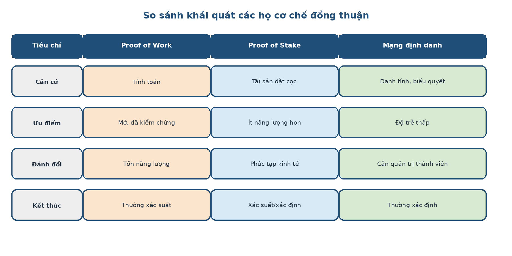

Hình 1.4. So sánh khái quát các nhóm cơ chế đồng thuận

Lựa chọn đồng thuận là bài toán đánh đổi giữa mức phân tán quyền quyết định, khả năng chịu lỗi, độ trễ, thông lượng và chi phí vận hành [10]. “Bộ ba phân quyền – an toàn – khả năng mở rộng” có thể dùng như một khung trực giác, không phải định luật buộc mọi hệ thống chỉ được chọn hai thuộc tính. Cơ chế phù hợp phải được đánh giá trên tải thực tế, số tổ chức vận hành, loại hành vi đối phương và yêu cầu phục hồi, thay vì dựa trên tên gọi hoặc tuyên bố hiệu năng của nền tảng.

## Phân loại Blockchain và điều kiện lựa chọn

### Các trục phân loại

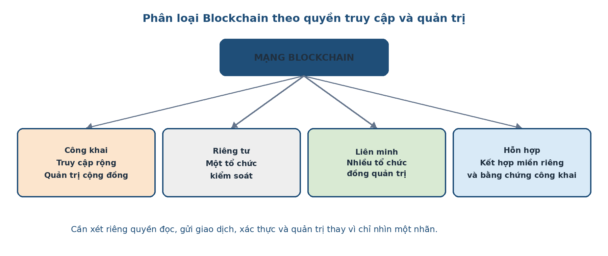

Hình 1.5. Phân loại Blockchain theo phạm vi tham gia và quyền truy cập

Blockchain có thể được phân loại theo nhiều trục độc lập. Trục quyền tham gia phân biệt mạng không cấp quyền, nơi chủ thể có thể tham gia theo quy tắc mở, với mạng cấp quyền, nơi danh tính và vai trò được phê duyệt trước [1]. Trục phạm vi quản trị phân biệt mạng công khai, mạng riêng do một miền quản trị chi phối và mạng liên minh do nhiều tổ chức cùng quản trị. Quyền đọc dữ liệu lại là một quyết định khác: một mạng cấp quyền có thể cho công chúng đọc bằng chứng tối thiểu, trong khi một mạng công khai vẫn có thể sử dụng cơ chế bảo vệ nội dung riêng tư. Vì vậy, không nên đồng nhất “công khai” với “không cấp quyền”, hoặc “riêng tư” với “cấp quyền” [1], [8].

### So sánh các mô hình triển khai

Bảng 1-1: So sánh khái quát các mô hình triển khai Blockchain

| Tiêu chí | Công khai, không cấp quyền | Riêng, cấp quyền | Liên minh, cấp quyền |
| --- | --- | --- | --- |
| Quản trị | Cộng đồng và quy tắc giao thức | Một tổ chức hoặc một miền quản trị | Nhiều tổ chức theo chính sách chung |
| Thành viên xác thực | Mở theo điều kiện chống Sybil | Danh tính được phê duyệt nội bộ | Danh tính thuộc các tổ chức thành viên |
| Khả năng kiểm chứng | Rộng, thường công khai | Chủ yếu trong nội bộ | Giữa các thành viên và bên được cấp quyền |
| Quyền riêng tư | Khó kiểm soát phạm vi phổ biến dữ liệu | Dễ giới hạn hơn theo chính sách nội bộ | Có thể phân vùng theo tổ chức và nghiệp vụ |
| Hiệu năng | Phụ thuộc mạng mở và cơ chế kinh tế | Có thể tối ưu trong phạm vi nhỏ | Phụ thuộc số tổ chức, túc số và hạ tầng |
| Bài toán phù hợp | Hệ sinh thái mở cần kiểm chứng rộng | Nhật ký và quy trình nội bộ | Phối hợp và kiểm toán liên tổ chức |

Mạng mở tạo khả năng kiểm chứng rộng và chống Sybil bằng nguồn lực kinh tế, nhưng thường phát sinh phí, độ trễ và khó kiểm soát phạm vi phổ biến dữ liệu. Mạng riêng dễ quản trị và tối ưu hiệu năng, song giá trị phân tán niềm tin bị hạn chế nếu một tổ chức vẫn quyết định toàn bộ lịch sử. Mạng liên minh phân bổ quyền giữa nhiều tổ chức đã định danh, thuận lợi cho kiểm toán liên tổ chức và chính sách dữ liệu có kiểm soát, nhưng đòi hỏi thỏa thuận quản trị, vận hành nút và xử lý tranh chấp [1], [8], [10].

Không mô hình nào mặc nhiên tốt hơn. Hiệu năng thực tế phụ thuộc thuật toán đồng thuận, số nút, chính sách xác nhận, hạ tầng mạng, kích thước giao dịch và cách tổ chức dữ liệu. Vì vậy, các con số thông lượng hoặc độ trễ chỉ có ý nghĩa khi được đo trên cấu hình và tải xác định [10].

### Khi nên và không nên sử dụng Blockchain

Nên xem xét Blockchain khi nhiều tổ chức cần cùng cập nhật trạng thái, lịch sử phải được kiểm chứng độc lập và không bên nào được chấp nhận làm chủ thể duy nhất có quyền sửa dữ liệu. Quy trình cũng phải đủ rõ để biểu diễn thành giao dịch, các bên có động lực vận hành chung và dữ liệu có thể được tối thiểu hóa phù hợp với yêu cầu riêng tư [1], [10].

Không nên sử dụng Blockchain nếu chỉ một tổ chức chịu trách nhiệm và được các bên tin cậy, nếu dữ liệu phải sửa hoặc xóa thường xuyên, hoặc nếu tải và độ trễ vượt khả năng của cơ chế đồng thuận. Một cơ sở dữ liệu truyền thống có nhật ký kiểm toán và chữ ký số có thể đơn giản, rẻ và dễ quản trị hơn trong các trường hợp đó. Blockchain cũng không sửa được một quy trình nghiệp vụ mơ hồ, dữ liệu đầu vào kém chất lượng hay tranh chấp trách nhiệm giữa các tổ chức.

## An toàn, quyền riêng tư và khả năng mở rộng

### Mô hình đe dọa và bảo vệ nhiều lớp

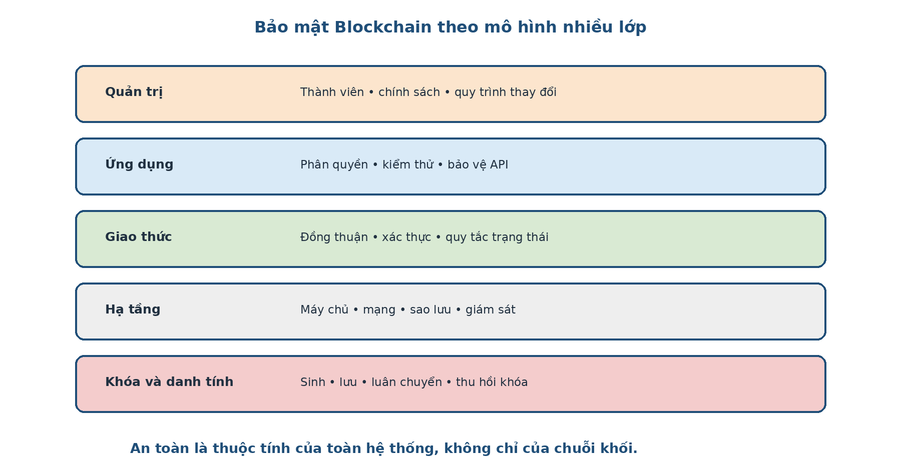

Hình 1.6. Các lớp bảo vệ trong một hệ thống Blockchain

An toàn Blockchain không chỉ phụ thuộc hàm băm hoặc đồng thuận mà phải được xem xét theo nhiều lớp: mật mã, mạng, đồng thuận, hợp đồng thông minh, ứng dụng, lưu trữ ngoài chuỗi và quản trị vận hành [1], [10]. Tài sản cần bảo vệ gồm khóa bí mật, danh tính thành viên, trạng thái sổ cái, dữ liệu nghiệp vụ, cấu hình nút và nhật ký. Đối phương có thể là người ngoài tấn công hạ tầng, người dùng bị chiếm tài khoản, quản trị viên lạm quyền hoặc một nhóm nút thông đồng.

Biện pháp bảo vệ phải bám vào mô hình đe dọa. Kênh truyền cần được mã hóa và xác thực; nút cần vá lỗi, phân đoạn mạng, giám sát và sao lưu; chính sách đồng thuận phải giới hạn quyền của một tổ chức; ứng dụng phải kiểm soát đầu vào, phiên đăng nhập và phân quyền. Việc nhiều nút lưu sổ cái không thay thế kế hoạch ứng phó sự cố: nếu các nút cùng phụ thuộc một hạ tầng, cùng dùng cấu hình sai hoặc cùng bị lộ khóa, lỗi có thể lan rộng trên toàn hệ thống.

### Quản lý khóa, hợp đồng thông minh và nguồn dữ liệu ngoài

Khóa bí mật đại diện cho quyền ký giao dịch nên cần được quản lý suốt vòng đời: sinh bằng nguồn ngẫu nhiên an toàn, lưu trong kho được bảo vệ, giới hạn mục đích sử dụng, luân chuyển, sao lưu có kiểm soát và thu hồi khi nghi ngờ lộ [5]. Mô-đun bảo mật phần cứng, chữ ký nhiều bên hoặc mật mã ngưỡng có thể giảm rủi ro một khóa hay một cá nhân trở thành điểm lỗi đơn, nhưng không loại bỏ nhu cầu quản trị và phục hồi.

Hợp đồng thông minh cần kiểm tra quyền, dữ liệu đầu vào, chuyển trạng thái và các trường hợp đồng thời; phiên bản mới phải có quy trình rà soát, kiểm thử và phê duyệt [10]. Nguồn dữ liệu ngoài phải được xác định thẩm quyền, ký số khi phù hợp và có thời hạn hiệu lực. Dùng nhiều nguồn chỉ hữu ích khi các nguồn đủ độc lập; nếu tất cả cùng lấy dữ liệu từ một hệ thống gốc, biểu quyết không làm dữ liệu đáng tin hơn.

### Quyền riêng tư và dữ liệu cá nhân

Sổ cái được nhân bản và khó sửa đặt ra xung đột với yêu cầu hạn chế mục đích sử dụng, chỉnh sửa hoặc xóa dữ liệu cá nhân. Đưa trực tiếp họ tên, ngày sinh, điểm số hay tệp văn bằng lên chuỗi làm tăng phạm vi sao chép và khó kiểm soát thời hạn lưu giữ. Mã hóa không giải quyết hoàn toàn vấn đề vì bản mã tồn tại lâu dài và khóa có thể bị lộ trong tương lai.

Cách tiếp cận phù hợp là tối thiểu hóa dữ liệu trên chuỗi, giữ hồ sơ chi tiết ở kho ngoài chuỗi có phân quyền và chỉ ghi bằng chứng mật mã hoặc trạng thái cần thiết cho kiểm chứng [1], [9]. Tuy nhiên, giá trị băm không mặc nhiên ẩn danh: nếu dữ liệu gốc dễ đoán, kẻ tấn công có thể thử các khả năng và so sánh kết quả; bản ghi cũng có thể liên kết với sự kiện hoặc định danh khác. Việc xóa dữ liệu ngoài chuỗi không xóa bằng chứng đã ghi, vì vậy thiết kế phải đánh giá khả năng liên kết, căn cứ xử lý và trách nhiệm của từng bên.

### Khả năng mở rộng và khả năng tương tác

Khi nhiều nút cùng lưu và kiểm tra giao dịch, thông lượng, độ trễ, băng thông và dung lượng trở thành các giới hạn cần đo [10]. Có thể cải thiện bằng cách xử lý theo lô, tối ưu chính sách xác nhận, phân vùng dữ liệu hoặc đưa một phần xử lý ra ngoài chuỗi; mỗi cách tạo thêm giả định tin cậy và độ phức tạp. Các giải pháp lớp 2 chỉ nên được xem xét khi thật sự kế thừa an toàn từ chuỗi cơ sở, không nên đồng nhất mọi sidechain hoặc cầu nối với lớp 2.

Khả năng tương tác không chỉ là truyền thông điệp giữa hai mạng mà còn là thống nhất ý nghĩa dữ liệu, định danh tổ chức, phiên bản lược đồ và trạng thái nghiệp vụ. Cầu nối hoặc dịch vụ chuyển tiếp bổ sung điểm tin cậy mới và từng là mục tiêu của nhiều sự cố. Các chuẩn dữ liệu chứng thực như W3C Verifiable Credentials giúp thống nhất cách biểu diễn vai trò phát hành, chủ thể và bên xác minh, nhưng không tự giải quyết quản trị khóa, quyền truy cập hay tranh chấp pháp lý [9].

## Định hướng ứng dụng trong quản lý văn bằng, chứng chỉ

### Bài toán, tác nhân và yêu cầu kiểm chứng

Quản lý văn bằng, chứng chỉ liên quan ba vai trò chính: cơ sở đào tạo phát hành, người học nắm giữ hoặc chia sẻ và tổ chức bên ngoài xác minh [9]. Quy trình truyền thống thường dựa vào bản giấy, bản sao chứng thực hoặc yêu cầu xác nhận thủ công; khi dữ liệu nằm ở nhiều hệ thống, việc đối soát có thể chậm và khó phát hiện tài liệu đã bị chỉnh sửa. Một sổ bằng chứng dùng chung có thể hỗ trợ bên xác minh kiểm tra nguồn phát hành, tính toàn vẹn và trạng thái hiện thời mà giảm số bước liên hệ thủ công.

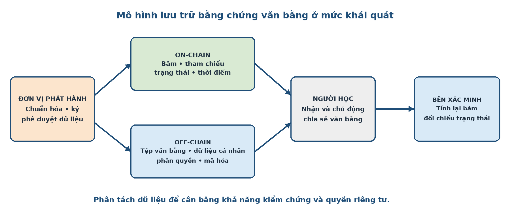

Hình 1.7. Mô hình khái niệm ứng dụng Blockchain trong quản lý văn bằng

Yêu cầu kiểm chứng không chỉ là so sánh mã băm. Hệ thống phải xác định đơn vị nào có thẩm quyền phát hành, khóa nào hợp lệ tại thời điểm ký, dữ liệu nào tạo thành nội dung văn bằng và trạng thái nào cho phép sử dụng. Kết quả không tìm thấy bằng chứng cũng không đủ để kết luận văn bằng giả, bởi hồ sơ cũ có thể chưa được số hóa hoặc nằm ngoài phạm vi hệ thống.

### Mô hình dữ liệu khái niệm trên chuỗi và ngoài chuỗi

Ở mức khái niệm, sổ cái chỉ nên giữ lượng dữ liệu tối thiểu phục vụ kiểm chứng, chẳng hạn cam kết mật mã, tham chiếu đơn vị phát hành và trạng thái hiệu lực. Hồ sơ đầy đủ cùng dữ liệu cá nhân được quản lý ngoài chuỗi trong hệ thống có thẩm quyền, với mã hóa, phân quyền, nhật ký truy cập và sao lưu. Hai miền được liên kết bằng quy tắc tạo bằng chứng xác định để tài liệu bị thay đổi tạo kết quả kiểm tra khác [1], [9].

Cách phân tách này giảm việc sao chép dữ liệu nhạy cảm nhưng không làm rủi ro riêng tư biến mất. Bằng chứng trên chuỗi vẫn có thể bị liên kết hoặc dò đoán; kho ngoài chuỗi vẫn có thể bị mất, sửa hoặc ngừng phục vụ. Vì vậy, Chương II cần xác định mô hình dữ liệu, quy tắc chuẩn hóa, quyền truy cập và cơ chế xử lý khi dữ liệu nguồn sai mà không giả định Blockchain tự giải quyết các vấn đề đó.

### Giá trị kỳ vọng, giới hạn và ranh giới trách nhiệm

Giá trị kỳ vọng là rút ngắn thời gian xác minh, tăng khả năng phát hiện tài liệu bị sửa và tạo lịch sử trạng thái dùng chung giữa các tổ chức. Công nghệ có thể hỗ trợ ghi nhận phát hành hoặc thay đổi hiệu lực, nhưng không tự quyết định người học đủ điều kiện tốt nghiệp, không chứng minh người xuất trình là chủ văn bằng và không đánh giá chất lượng đào tạo.

Cơ sở đào tạo vẫn chịu trách nhiệm về dữ liệu đầu vào và thẩm quyền phát hành; người vận hành chịu trách nhiệm bảo vệ khóa và hạ tầng; bên xác minh phải diễn giải kết quả đúng phạm vi. Nếu khóa phát hành bị lộ, bản ghi kỹ thuật hợp lệ vẫn có thể được tạo cho đến khi quyền bị thu hồi. Do đó, Blockchain phải được xem là công cụ hỗ trợ kiểm chứng, không phải nguồn phán quyết duy nhất.

## Tổng kết Chương I

### Kết quả lý luận chính

Chương I đã trình bày Blockchain như một kiến trúc sổ cái phân tán kết hợp cấu trúc liên kết băm, chữ ký số, mạng ngang hàng và đồng thuận. Mức bảo đảm của hệ thống phụ thuộc đồng thời vào giả định mật mã, số nút lỗi, quản trị khóa, chất lượng ứng dụng và dữ liệu ngoài chuỗi; vì vậy không thể đồng nhất Blockchain với tính bất biến hay an toàn tuyệt đối [1], [10]. Phân tích cũng cho thấy việc lựa chọn mô hình công khai, riêng, cấp quyền hoặc không cấp quyền phải xuất phát từ ranh giới tin cậy và yêu cầu nghiệp vụ.

### Cơ sở chuyển sang Chương II

Đối với quản lý văn bằng, hướng tiếp cận phù hợp ở mức khái niệm là giữ hồ sơ cá nhân ngoài chuỗi và chỉ sử dụng sổ cái cho bằng chứng tối thiểu cùng lịch sử trạng thái. Chương II sẽ chuyển các nguyên tắc này thành yêu cầu chức năng, yêu cầu an toàn, mô hình dữ liệu và luồng nghiệp vụ; đồng thời so sánh các phương án trước khi lựa chọn nền tảng, cấu trúc mạng và cơ chế triển khai cụ thể.

# CHƯƠNG II. PHÂN TÍCH VÀ THIẾT KẾ HỆ THỐNG

## 2.1. Phân tích bài toán

### 2.1.1. Bối cảnh nghiệp vụ

Quy trình văn bằng truyền thống có ba nhóm rủi ro chính. Thứ nhất, dữ liệu có thể bị nhập sai hoặc sửa trái phép trong hệ thống tập trung. Thứ hai, bên tuyển dụng thường phải liên hệ cơ sở đào tạo để xác minh, làm tăng thời gian và chi phí. Thứ ba, nếu một người có thể vừa lập vừa duyệt yêu cầu phát hành thì nguy cơ lạm quyền khó được kiểm soát. Blockchain chỉ hỗ trợ phát hiện thay đổi sau khi dữ liệu đã được chấp nhận; nó không tự bảo đảm dữ liệu đầu vào đúng [1], [10]. Vì vậy bài toán phải kết hợp kiểm soát quy trình, quản trị khóa và bằng chứng blockchain.

Hệ thống được thiết kế cho một cơ sở đào tạo phát hành chứng thư Blockcerts V3. Thông tin nghiệp vụ và tài khoản lưu trong PostgreSQL; chứng thư hoàn chỉnh lưu ngoài chuỗi; Bitcoin chỉ nhận Merkle root của lô hoặc dấu vết thu hồi qua `OP_RETURN`. Mô hình này hạn chế đưa dữ liệu cá nhân trực tiếp lên blockchain, đồng thời cho phép phát hiện chứng thư bị sửa [2], [3].

### 2.1.2. Phạm vi

Phạm vi đồ án gồm đăng nhập, quản lý tài khoản, lập–duyệt yêu cầu, phát hành đơn/lô tối đa 500 chứng thư, holder portal, xác minh công khai, thu hồi, audit và triển khai pilot. Bitcoin chạy regtest; đây là mạng phát triển cho phép tạo block chủ động và không dùng tiền thật [18]. Hệ thống không tuyên bố đã sẵn sàng cho văn bằng pháp lý trên mainnet, không thay thế nghiệp vụ xét tốt nghiệp và không xác thực danh tính ngoài các tài khoản do đơn vị tạo.

## 2.2. Tác nhân và yêu cầu chức năng

### 2.2.1. Tác nhân

Hệ thống có ba vai trò xác thực và một tác nhân công khai:

- **Maker:** lập yêu cầu đơn hoặc lô; xem trạng thái và audit; không được duyệt hoặc thu hồi.
- **Checker:** duyệt/từ chối yêu cầu, quản lý tài khoản, xem audit và thu hồi chứng thư đã phát hành.
- **Student:** đăng nhập cổng Holder để xem/tải chứng thư được liên kết với mình; không được vào cổng quản trị.
- **Người xác minh:** không cần đăng nhập; tải hoặc dán JSON chứng thư để nhận kết luận.

Không có vai trò `Admin` độc lập trong phiên bản mã nguồn được báo cáo. Tên “cổng Admin” chỉ mô tả cổng nghiệp vụ phía cơ sở đào tạo dành cho Maker và Checker, không phải một role thứ tư.

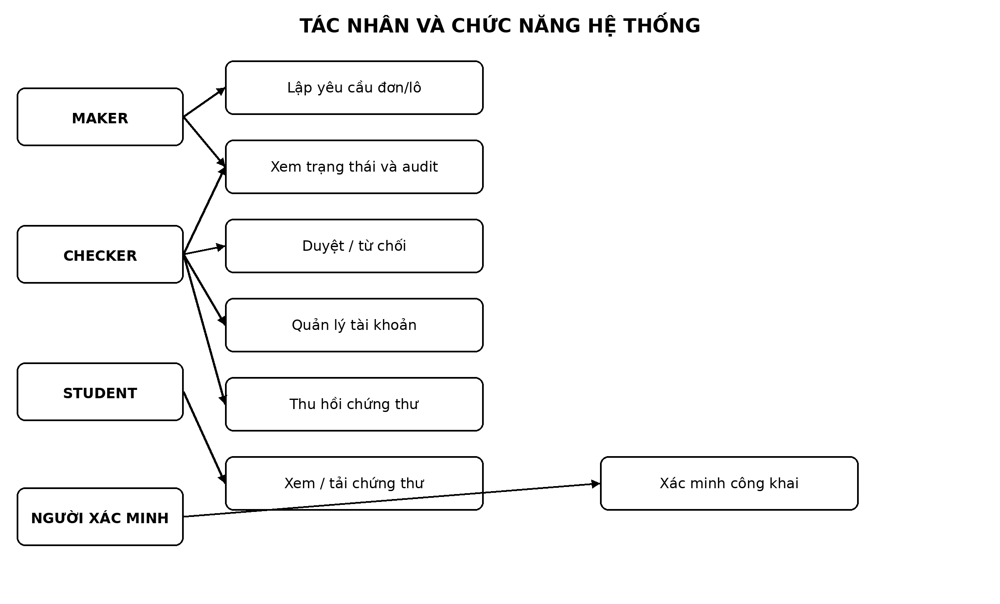

### 2.2.2. Yêu cầu chức năng

Bảng 2.1. Danh sách yêu cầu chức năng

| Mã | Yêu cầu | Tác nhân |
|---|---|---|
| FR-01 | Đăng nhập và nhận JWT | Maker, Checker, Student |
| FR-02 | Tạo/list tài khoản, không trả password hash | Checker |
| FR-03 | Tạo một yêu cầu phát hành | Maker |
| FR-04 | Tạo lô 1–500 yêu cầu | Maker |
| FR-05 | Duyệt hoặc từ chối yêu cầu | Checker |
| FR-06 | Phát hành Blockcerts V3 và neo Bitcoin | Worker sau khi Checker duyệt |
| FR-07 | Xem danh sách, chi tiết và trạng thái | Maker, Checker |
| FR-08 | Xem/tải chứng thư của mình | Student |
| FR-09 | Xác minh chứng thư JSON | Công khai |
| FR-10 | Thu hồi chứng thư đã phát hành | Checker |
| FR-11 | Công bố Issuer Profile và Revocation List | Công khai |
| FR-12 | Ghi và đọc audit nghiệp vụ | Hệ thống; Maker/Checker đọc |
| FR-13 | Kiểm tra sức khỏe dịch vụ | Công khai có giới hạn thông tin |

### 2.2.3. Quy tắc nghiệp vụ

Yêu cầu mới có trạng thái `pending_approval`. Maker không được gọi API duyệt; Checker lấy danh tính từ JWT thay vì tin `approvedBy` do client gửi. Khi duyệt, yêu cầu chuyển `queued` và được đưa vào BullMQ. Worker chuyển lần lượt sang `processing`, `issued` hoặc `failed`. Checker chỉ thu hồi bản ghi `issued`; chứng thư thu hồi chuyển `revoked` và không bị xóa.

Phát hành theo lô yêu cầu tất cả bản ghi thuộc trạng thái cho phép. Mỗi bản ghi vẫn có `certUid` riêng; các bản ghi trong cùng lô dùng chung `batchId`, Merkle root và transaction id. Cột `txid` không được đặt duy nhất, vì Merkle batching chủ ý cho phép nhiều chứng thư cùng neo vào một transaction [3], [14].

## 2.3. Yêu cầu phi chức năng và mô hình đe dọa

### 2.3.1. Yêu cầu phi chức năng

- **An toàn:** băm mật khẩu; JWT có thời hạn; RBAC ở backend; bí mật ngoài Git; giới hạn tần suất và kích thước yêu cầu.
- **Toàn vẹn:** sửa payload, proof hoặc transaction id phải không còn kết luận `VALID`.
- **Truy vết:** lưu người lập, người duyệt, người thu hồi, transaction và audit.
- **Hiệu năng:** tối đa 500 chứng thư/lô trong phạm vi nguyên mẫu; một transaction neo cho mỗi lô.
- **Khả dụng:** tách request HTTP khỏi tác vụ phát hành dài; có queue, health check và chính sách khởi động lại.
- **Tái lập:** dùng Compose, migration, scripts, freeze và checksum artifact.
- **Riêng tư:** không ghi toàn bộ hồ sơ cá nhân lên Bitcoin; không công bố credential hoặc khóa trong repository.

### 2.3.2. Tài sản và đối thủ

Tài sản gồm WIF phát hành, JWT secret, RPC/database credential, tài khoản, chứng thư, trạng thái phát hành–thu hồi, audit và cấu hình triển khai. Đối thủ có thể là người ngoài gửi chứng thư giả, tài khoản nội bộ vượt quyền, kẻ lấy được khóa, hoặc người vận hành sửa DB. Các bề mặt chính là API công khai, cổng đăng nhập, reverse proxy, queue, RPC Bitcoin, tệp workspace và chuỗi cung ứng phần mềm.

Bảng 2.2. Đe dọa và kiểm soát

| Đe dọa | Hậu quả | Kiểm soát thiết kế | Giới hạn còn lại |
|---|---|---|---|
| Maker tự duyệt | Phát hành không có kiểm soát chéo | RBAC, Checker-only approve | Tài khoản Checker bị chiếm vẫn nguy hiểm |
| Sửa chứng thư | Văn bằng giả | Hash, proof và anchor | Không phát hiện dữ liệu sai từ đầu vào hợp lệ |
| Chiếm mật khẩu | Mạo danh | bcrypt, JWT, throttling | Chưa có MFA |
| Lộ WIF | Neo bằng chứng giả | Bí mật ngoài Git, RPC cục bộ | Chưa dùng HSM/KMS |
| Sửa DB thu hồi | Kết luận trạng thái sai | OP_RETURN thu hồi, audit | Chưa có indexer tái tạo từ chuỗi |
| DoS Verify | Cạn tài nguyên | body limit, throttling, Nginx | Chưa thử tải tấn công dài hạn |
| Lộ dữ liệu runtime | Rò rỉ thông tin | workspace ngoài Git, ignore | Cần chính sách xóa/lưu giữ |

OWASP khuyến nghị từ chối mặc định, kiểm tra quyền trên mọi yêu cầu và kiểm thử logic phân quyền [16]. Vì vậy frontend chỉ ẩn chức năng để cải thiện trải nghiệm; backend mới là lớp quyết định quyền.

## 2.4. Lựa chọn công nghệ và kiến trúc

### 2.4.1. Lựa chọn mô hình Blockcerts–Bitcoin

Blockcerts biểu diễn chứng thư dưới dạng JSON-LD/Verifiable Credential và gắn bằng chứng Merkle. Mô hình VC phân biệt issuer, holder và verifier [9]; JSON-LD cung cấp ngữ nghĩa liên kết [12]. Schema và context Blockcerts được dùng làm nguồn đối chiếu cấu trúc [11]. Trong chứng thư thực tế của hệ thống, `proof.type` là `DataIntegrityProof`, `cryptosuite` là `merkle-proof-2019`; receipt nằm trong `proofValue` và được giải mã bằng bộ `LDMerkleProof2019` [13], [14].

Bitcoin regtest được chọn thay vì hợp đồng thông minh. Giá trị on-chain chỉ là Merkle root hoặc chuỗi thu hồi được mã hóa trong `OP_RETURN`; toàn bộ workflow vẫn ở ứng dụng và PostgreSQL. Thiết kế này bám sát toolchain Blockcerts hiện có, giảm phạm vi dữ liệu công khai và cho phép một giao dịch đại diện nhiều chứng thư. Nhược điểm là cần dịch vụ ngoài chuỗi cho issuer profile, revocation list và quản lý nghiệp vụ.

### 2.4.2. Kiến trúc thành phần

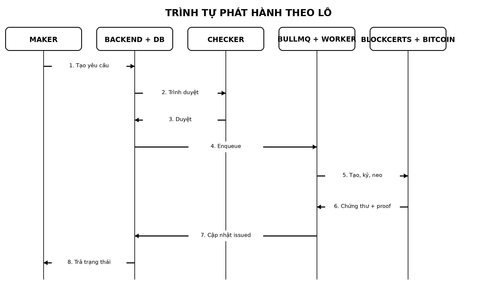

Hệ thống gồm ba frontend React; Nginx reverse proxy; backend NestJS; PostgreSQL; Redis/BullMQ; worker; container `cert-tools`; container `cert-issuer`; verifier service; Bitcoin Core regtest. Các thành phần dữ liệu và RPC chỉ bind loopback. Cổng quản trị, Holder và Verify được tách để giảm nhầm lẫn quyền và cho phép triển khai độc lập.

NestJS cung cấp module, guard và validation [19]. PostgreSQL cung cấp transaction và ràng buộc dữ liệu [20]. TypeORM quản lý entity/migration [22]. BullMQ dùng Redis để chuyển tác vụ dài khỏi request HTTP [21]. Việc chọn công nghệ không có nghĩa framework tự bảo đảm an toàn; cấu hình, kiểm thử và quy trình vận hành vẫn quyết định kết quả.

### 2.4.3. Luồng dữ liệu

Maker gửi thông tin người nhận và khóa công khai tới backend. Backend lưu yêu cầu; sau khi Checker duyệt, worker tạo roster và gọi toolchain phát hành. Chứng thư đã ký được lưu ngoài chuỗi; `certUid`, `txid`, `merkleRoot`, trạng thái và actor được lưu DB. Bitcoin chỉ nhận root. Student tải JSON qua Holder API. Verify portal gửi JSON tới backend, backend phối hợp verifier service, Bitcoin RPC và DB thu hồi để kết luận.

## 2.5. Thiết kế Maker–Checker và máy trạng thái

### 2.5.1. Luồng phát hành

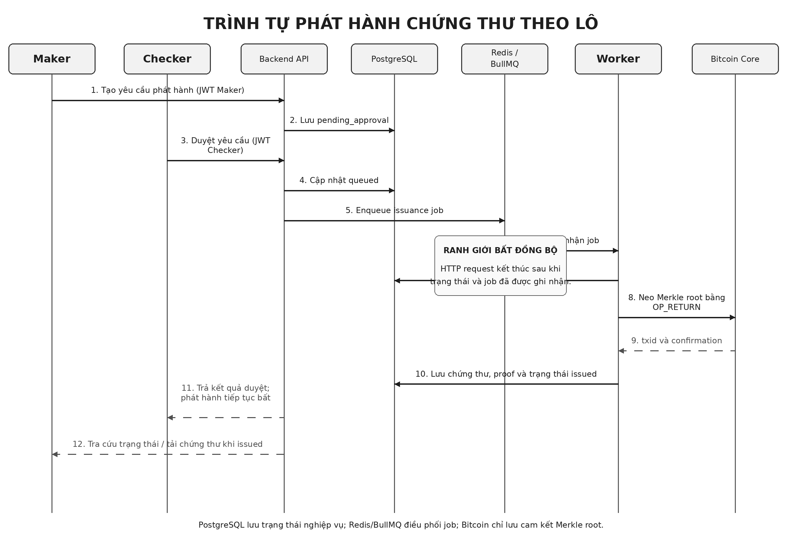

1. Maker đăng nhập và gửi một yêu cầu hoặc mảng tối đa 500 phần tử.
2. Backend lấy actor từ JWT, kiểm tra DTO và lưu `pending_approval`.
3. Checker xem danh sách, duyệt hoặc từ chối.
4. Khi duyệt, backend đặt `queued` và enqueue job.
5. Worker đặt `processing`, tạo chứng thư unsigned theo các chunk riêng.
6. Các output được gom để `cert-issuer` tạo một cây Merkle và một anchor.
7. Regtest tạo một block; worker giải mã proof, ánh xạ bằng nonce và cập nhật `issued`.
8. Holder tải chứng thư; bên thứ ba có thể Verify.

### 2.5.2. Trạng thái

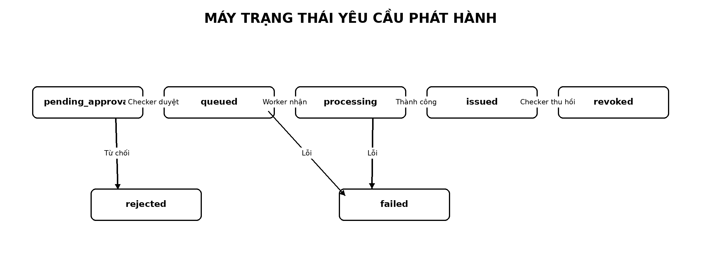

Luồng chính: `pending_approval → queued → processing → issued → revoked`. Hai nhánh thay thế là `pending_approval → rejected` và `queued/processing → failed`. Không cho chuyển ngược tự do, vì điều đó làm mất ý nghĩa audit. Yêu cầu thất bại chỉ được xử lý lại bằng quy trình vận hành có kiểm soát.

Bảng 2.3. Ý nghĩa trạng thái

| Trạng thái | Ý nghĩa | Tác nhân chuyển |
|---|---|---|
| `pending_approval` | Chờ Checker xem xét | Maker tạo |
| `rejected` | Bị từ chối, có lý do | Checker |
| `queued` | Đã duyệt và chờ worker | Checker/service |
| `processing` | Toolchain đang xử lý | Worker |
| `issued` | Có chứng thư và anchor | Worker |
| `failed` | Worker kết thúc lỗi | Worker |
| `revoked` | Chứng thư mất hiệu lực | Checker |

## 2.6. Thiết kế phát hành Blockcerts V3

### 2.6.1. Cấu trúc chứng thư

Chứng thư gồm `@context`, mảng `type` chứa `VerifiableCredential` và `BlockcertsCredential`, URI issuer, `issuanceDate`, `id`, `credentialSubject`, nội dung hiển thị và `proof`. `credentialSubject.id` phải là URI định danh, không dùng địa chỉ Bitcoin trần. Khóa công khai của người nhận được cung cấp ở đầu vào phát hành; nonce ngẫu nhiên phục vụ ánh xạ nội bộ giữa roster và output.

`DataIntegrityProof` gồm thời điểm tạo, mục đích `assertionMethod`, verification method trỏ tới Issuer Profile, cryptosuite `merkle-proof-2019` và `proofValue`. `proofValue` bao gói receipt Merkle, trong đó có target hash, proof và anchor Bitcoin. Cấu trúc được tạo bởi toolchain Blockcerts, không phải hợp đồng thông minh [11], [14].

### 2.6.2. Batching và ánh xạ kết quả

Phương án chạy toàn bộ toolchain cho từng hồ sơ gây chi phí khởi động container và tăng transaction. Thiết kế cuối chia bước tạo unsigned certificate thành chunk 10 hồ sơ, tối đa 16 chunk đồng thời trên máy thử nghiệm. Mỗi chunk có workspace riêng; sau đó toàn bộ output được gom vào một thư mục để `cert-issuer` tạo một root và một transaction.

Tên người nhận có thể trùng và tên file do tool tạo không nên dùng làm khóa. Mỗi dòng roster nhận một nonce ngẫu nhiên; worker đọc nonce trong output để tìm đúng bản ghi DB. `batchId` dùng cho truy vấn và thực nghiệm, còn `certUid` dùng định danh chứng thư. Nếu mở giới hạn trên 500, cần chia thành nhiều anchor job thay vì ngầm tạo một lô vượt khả năng đã kiểm thử.

## 2.7. Thiết kế xác minh và thu hồi

### 2.7.1. Xác minh

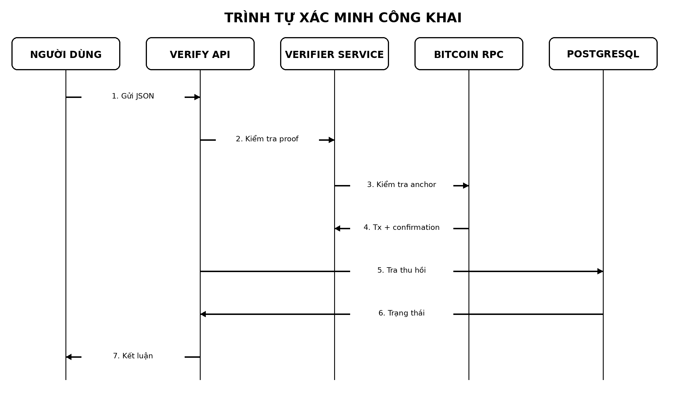

Verify API tiếp nhận toàn bộ JSON. Backend kiểm tra semantic tối thiểu, sau đó gửi chứng thư đến verifier service. Verifier giải mã `proofValue` bằng `LDMerkleProof2019`, kiểm tra cấu trúc/chứng thư; adapter regtest lấy transaction theo `txid`, kiểm tra đầu vào gắn với issuer, tìm `OP_RETURN`, so Merkle root và yêu cầu ít nhất một confirmation. Nếu lớp mật mã/anchor đạt, backend lấy `certUid` để tra thu hồi. Kết luận gồm `VALID`, `INVALID`, `REVOKED` hoặc `INDETERMINATE`.

`INVALID` dùng khi nội dung không khớp bằng chứng; `REVOKED` dùng khi chứng thư vốn hợp lệ nhưng đã bị thu hồi; `INDETERMINATE` dùng khi không đủ bằng chứng để kết luận, ví dụ transaction/proof không thể kiểm tra. Phân biệt này tránh biến lỗi kết nối thành tuyên bố chứng thư giả.

### 2.7.2. Thu hồi

Checker chọn bản ghi `issued` và nhập lý do. Backend tạo payload `REVOKE:<certUid>`, mã hóa hex, tạo raw transaction có `OP_RETURN`, ký bằng khóa phát hành, broadcast và tạo một block regtest. Sau đó DB lưu `revocationTxid`, `revokedBy`, `revokeReason`, `revokedAt` và trạng thái `revoked`; Issuer Revocation List đọc dữ liệu này để công bố.

Thu hồi có hai dấu vết: transaction Bitcoin và chỉ mục DB/Revocation List. Phiên bản hiện tại kiểm tra nhanh từ DB sau khi đã kiểm tra chứng thư/anchor; nó chưa quét blockchain để tự xây lại trạng thái. Vì vậy backup DB và một indexer phục hồi là yêu cầu cho bản sản xuất.

## 2.8. Thiết kế dữ liệu ngoài chuỗi

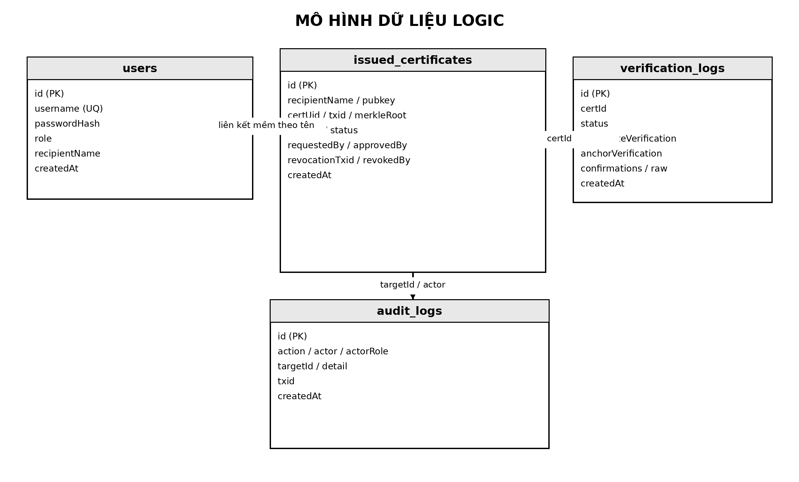

### 2.8.1. Bảng `users`

Bảng lưu `id`, `username` duy nhất, `passwordHash`, `role`, `recipientName` tùy chọn và `createdAt`. `recipientName` là liên kết mềm giữa tài khoản Student và chứng thư. Cách này đủ cho nguyên mẫu nhưng có nguy cơ trùng tên; phiên bản tiếp theo cần `studentCode` ổn định và ràng buộc rõ ràng.

### 2.8.2. Bảng `issued_certificates`

Mỗi dòng vừa là yêu cầu nghiệp vụ vừa là chứng thư sau phát hành. Nhóm đầu vào gồm `recipientName`, `pubkey`, `identity`; nhóm blockchain gồm `certUid`, `txid`, `merkleRoot`, `batchId`; nhóm Maker–Checker gồm `requestedBy`, `approvedBy`, `rejectedBy`, `rejectReason`; nhóm trạng thái gồm `status`, `errorMessage`; nhóm thu hồi gồm `revocationTxid`, `revokedBy`, `revokeReason`, `revokedAt`.

Thiết kế một bảng làm giảm số phép nối và phù hợp nguyên mẫu, nhưng làm trộn dữ liệu yêu cầu với artifact phát hành. Khi mở rộng, nên tách `issuance_requests`, `batches` và `certificates`, thêm khóa ngoại tới student/user và quy tắc duy nhất theo định danh ổn định.

### 2.8.3. `verification_logs` và `audit_logs`

`verification_logs` lưu `certId`, trạng thái, kết quả verifier, kết quả adapter, confirmation, phản hồi thô và thời gian. `audit_logs` lưu action, actor, role, target, detail, txid và thời gian. Verification log phục vụ phân tích kỹ thuật; audit log phục vụ truy trách nhiệm nghiệp vụ. Cả hai nằm trong DB nên phải có kiểm soát truy cập, backup và chính sách lưu giữ; chúng không tự bất biến chỉ vì hệ thống có blockchain.

Bảng 2.4. Mô hình dữ liệu chính

| Bảng | Khóa/định danh | Chức năng |
|---|---|---|
| `users` | UUID, username unique | Tài khoản và vai trò |
| `issued_certificates` | UUID, certUid, batchId | Vòng đời yêu cầu/chứng thư |
| `verification_logs` | UUID, certId | Lịch sử xác minh |
| `audit_logs` | UUID, targetId | Nhật ký hành động |

## 2.9. Thiết kế API và phân quyền

Bảng 2.5. API chính và quyền

| Phương thức | Endpoint | Quyền | Chức năng |
|---|---|---|---|
| POST | `/api/auth/login` | Công khai | Đăng nhập |
| POST | `/api/auth/register` | Checker | Tạo tài khoản |
| GET/POST | `/api/admin/users` | Checker | List/tạo tài khoản |
| GET | `/api/audit` | Maker, Checker | Xem audit mới nhất |
| POST | `/api/issue/request` | Maker | Lập một yêu cầu |
| POST | `/api/issue/batch/request` | Maker | Lập 1–500 yêu cầu |
| POST | `/api/issue/:id/approve` | Checker | Duyệt một yêu cầu |
| POST | `/api/issue/batch/approve` | Checker | Duyệt theo lô |
| POST | `/api/issue/:id/reject` | Checker | Từ chối |
| GET | `/api/issue`, `/api/issue/:id` | Maker, Checker | Danh sách/chi tiết |
| GET | `/api/issue/holder/certificates` | Student | Chứng thư của holder |
| POST | `/api/revoke/:id` | Checker | Thu hồi |
| POST | `/api/revoke/check` | Công khai | Kiểm tra nhanh thu hồi |
| POST | `/api/verify` | Công khai | Xác minh JSON |
| GET | `/api/blockcerts/issuers/kma/profile.json` | Công khai | Issuer Profile |
| GET | `/api/blockcerts/issuers/kma/revocation-list.json` | Công khai | Revocation List |
| GET | `/health` | Công khai | Health check |

Route tĩnh `batch/request`, `batch/approve`, `holder/certificates` và `check` phải được khai báo trước route `:id`; nếu không router có thể hiểu chuỗi tĩnh là ID. ValidationPipe loại hoặc từ chối trường không được khai báo. Actor của approve/revoke lấy từ JWT [15], không lấy từ body.

## 2.10. Thiết kế ba cổng giao diện

Cổng quản trị phục vụ Maker và Checker. Maker có màn hình lập phiếu đơn/lô, danh sách và audit; Checker có màn hình duyệt, văn bằng, thu hồi, người dùng và audit. Menu thay đổi theo role nhưng backend vẫn kiểm tra quyền. Cổng Holder chỉ nhận tài khoản Student, hiển thị cả chứng thư còn hiệu lực và đã thu hồi để giữ lịch sử. Cổng Verify không yêu cầu tài khoản, nhận file/dữ liệu JSON và hiển thị trạng thái cùng chi tiết kiểm tra.

Ba frontend dùng chung API nhưng build độc lập. Khi triển khai sau Nginx, mỗi ứng dụng dùng base path riêng. Giao diện không tự tính hợp lệ ở client; nó gửi chứng thư tới backend để logic nhất quán và tránh phụ thuộc khả năng trình duyệt.

## 2.11. Thiết kế an toàn và triển khai

Mật khẩu được băm bcrypt. OWASP yêu cầu work factor đủ lớn và ưu tiên Argon2id cho hệ thống mới; bcrypt vẫn có thể dùng cho hệ thống cũ khi cấu hình phù hợp [17]. JWT được ký và có thời hạn theo mô hình RFC 7519 [15]. `AuthGuard` chạy trước `RolesGuard` trên route bảo vệ để `req.user` tồn tại trước khi xét role.

Helmet thêm security header; throttling giới hạn yêu cầu; CORS dùng allowlist; body có giới hạn; Swagger có thể cấu hình. PostgreSQL, Redis và Bitcoin RPC chỉ bind loopback. Nginx là điểm vào, backend/worker/Nginx được quản lý bởi systemd user service, còn các container có restart policy. `.env`, WIF, RPC credential, tài khoản thực nghiệm và workspace bị loại khỏi Git.

Thiết kế pilot dùng HTTP bên trong mạng riêng. HTTPS công khai, HSTS, secret manager, HSM/KMS, luân chuyển khóa, backup/restore, HA, giám sát tập trung và kiểm thử xâm nhập nằm ngoài phạm vi phiên bản này, nhưng là điều kiện trước production.

## 2.12. Tiêu chí chấp nhận và kế hoạch kiểm thử

Bảng 2.6. Tiêu chí chấp nhận

| Mã | Tiêu chí | Bằng chứng dự kiến |
|---|---|---|
| AC-01 | Chứng thư gốc `VALID` | Kịch bản 1 |
| AC-02 | Sửa nội dung/proof/txid không còn `VALID` | Kịch bản 1 |
| AC-03 | Maker tự duyệt bị 403 | Kịch bản 1 |
| AC-04 | 10, 100, 500 chứng thư/lô đều phát hành đủ | Kịch bản 2 |
| AC-05 | Mỗi lô dùng đúng một transaction | Artifact audit |
| AC-06 | Student/Maker không thu hồi được | Kịch bản 3 |
| AC-07 | Checker thu hồi và Verify trả `REVOKED` | Kịch bản 3 |
| AC-08 | Revocation List và audit nhất quán | Kịch bản 3 |
| AC-09 | Build, test, dependency audit và health đạt | B12 preflight/postflight |

## 2.13. Kết luận Chương 2

Chương 2 đã chuyển cơ sở lý thuyết thành thiết kế cụ thể: ba vai trò, ba cổng web, workflow Maker–Checker, bốn bảng dữ liệu, queue, toolchain Blockcerts V3, Merkle batching, neo/thu hồi qua Bitcoin regtest và xác minh nhiều lớp. Thiết kế không dùng hợp đồng thông minh và không đưa toàn bộ hồ sơ lên chuỗi. Các giới hạn về liên kết Student bằng tên, quản trị khóa, phục hồi trạng thái thu hồi và môi trường regtest được xác định trước để Chương 3 đánh giá đúng phạm vi.

# CHƯƠNG III. XÂY DỰNG, KIỂM THỬ VÀ ĐÁNH GIÁ HỆ THỐNG

## 3.1. Môi trường và công nghệ triển khai

### 3.1.1. Môi trường thực nghiệm

Bản thực nghiệm chính thức chạy trên Ubuntu Server 22.04.5 LTS, CPU Intel Xeon 16 lõi logic và khoảng 31 GiB RAM. Cấu hình được đóng băng bằng tag `b12-frozen-20260912-r2`; mọi số liệu định lượng lấy từ artifacts tạo sau mốc này. Bitcoin chạy regtest, cho phép chủ động tạo block mà không dùng tiền thật [18].

Bảng 3.1. Thành phần phần mềm

| Thành phần | Phiên bản/dòng phiên bản | Vai trò |
|---|---|---|
| Node.js | 22 | Runtime backend/frontend build |
| NestJS | 11 | REST API, JWT, RBAC và nghiệp vụ |
| PostgreSQL | 17-bookworm | Dữ liệu nghiệp vụ và log |
| Redis | 7.4-bookworm | Nền lưu trữ BullMQ |
| BullMQ | 5 | Hàng đợi phát hành |
| Bitcoin Core | 31.1 | Sổ cái regtest và RPC |
| cert-tools | 3.0.2 | Sinh chứng thư unsigned từ roster |
| cert-issuer | 3.13.1 | Tạo Merkle proof và neo Bitcoin |
| React/Vite | 19/7 | Ba giao diện web |
| Nginx | Bản hệ thống | Reverse proxy và base path |

Repository cung cấp Compose, migration, `.env.example`, script triển khai/health check và script thực nghiệm. PostgreSQL, Redis và Bitcoin RPC chỉ bind loopback. WIF, mật khẩu, JWT secret, RPC credential và tài khoản thử nghiệm nằm ngoài Git.

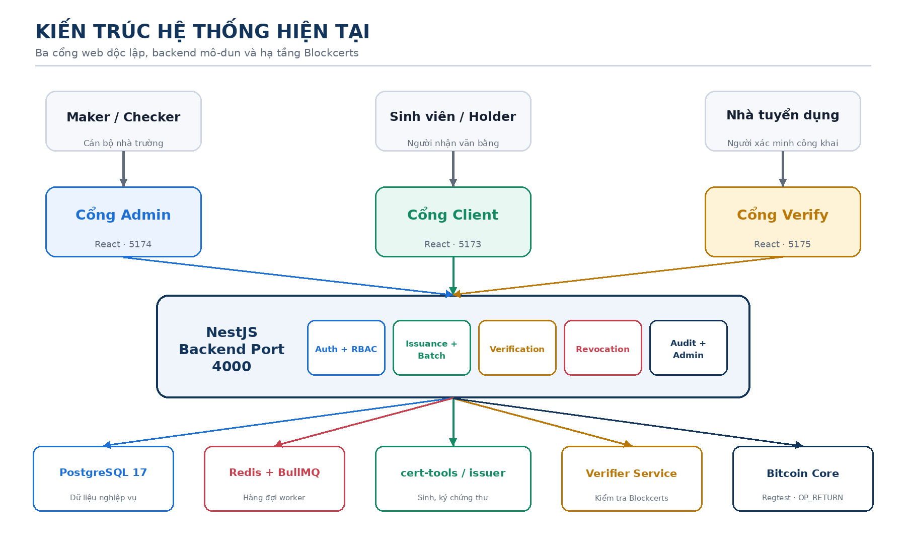

### 3.1.2. Tổ chức triển khai

PostgreSQL, Redis và Bitcoin Core chạy bằng Docker với restart policy. Backend, worker và Nginx được quản lý bằng systemd user service. Nginx phục vụ ba base path và chuyển tiếp API. Health check kiểm tra backend, DB, Redis và Bitcoin tùy mức ready. Kiến trúc này phù hợp pilot một máy; chưa phải kiến trúc HA nhiều node.

## 3.2. Hiện thực backend và cơ sở dữ liệu

### 3.2.1. Các module

Backend gồm `AuthModule`, `AdminModule`, `IssuanceModule`, `VerificationModule`, `RevocationModule`, `AuditModule`, `IssuerModule` và health controller. Controller gắn `AuthGuard` rồi `RolesGuard` tại route cần bảo vệ; service thực thi nghiệp vụ; entity mô tả dữ liệu; processor nhận job BullMQ. NestJS được chọn vì hỗ trợ module, dependency injection, guard và validation rõ ràng [19].

`AuthModule` đăng nhập, so khớp bcrypt và ký JWT. `AdminModule` cho Checker list/tạo tài khoản nhưng không trả `passwordHash`. `IssuanceModule` quản lý phiếu và worker. `VerificationModule` điều phối verifier service và lưu log. `RevocationModule` tạo transaction thu hồi. `IssuerModule` công bố profile cùng revocation list.

### 3.2.2. Migration và transaction

TypeORM chạy `synchronize=false`; schema thay đổi qua migration [22]. Bốn bảng chính là `users`, `issued_certificates`, `verification_logs` và `audit_logs`. PostgreSQL transaction bảo đảm nhóm thay đổi DB được commit hoặc rollback như một đơn vị [20]. `txid` không có unique constraint vì nhiều chứng thư trong một batch dùng chung transaction.

Bảng `issued_certificates` lưu cả yêu cầu và kết quả. Cách này làm workflow đơn giản nhưng tạo hạn chế đã nêu ở Chương 2. `batchId` bổ sung ở B12 để truy vết ổn định; worker cập nhật DB theo chunk 100 bản ghi nhằm tránh một câu lệnh quá lớn.

### 3.2.3. Audit và verification log

Audit được gắn vào đăng nhập, đăng ký, lập phiếu, duyệt, từ chối, phát hành, thu hồi và xác minh. Nếu riêng thao tác ghi audit lỗi, service không làm thất bại nghiệp vụ chính; lựa chọn này ưu tiên tính sẵn sàng nhưng cần cơ chế cảnh báo để không bỏ sót log âm thầm. Verification log lưu kết quả chi tiết từ verifier, adapter Bitcoin, confirmation và trạng thái cuối.

## 3.3. Hiện thực quy trình phát hành

### 3.3.1. Phát hành đơn và Maker–Checker

Maker gọi `/api/issue/request`. Backend lấy username từ JWT, không tin `requestedBy` trong body, và lưu bản ghi `pending_approval`. Checker gọi approve/reject. Yêu cầu được duyệt chuyển `queued`; BullMQ tách công việc nặng khỏi request HTTP [21]. Worker chuyển `processing`, tạo roster, gọi toolchain, tạo block và cập nhật `issued` hoặc `failed`.

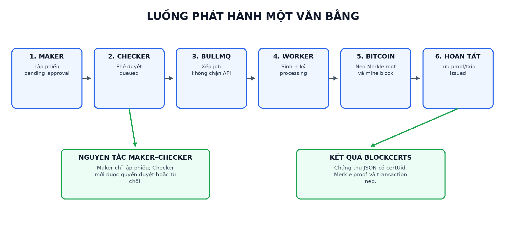

### 3.3.2. Tối ưu phát hành theo lô

Phương án tuần tự ban đầu lặp `cert-tools → cert-issuer → mine` cho từng hồ sơ, làm tăng chi phí khởi động container và số transaction. Một thử nghiệm roster 462 dòng chạy quá 5 phút mà chưa có output nên được hủy có kiểm soát, queue pause và bản ghi reset. Kết quả này không được dùng trong benchmark chính thức nhưng giúp xác định nút thắt.

Thiết kế cuối chia roster thành chunk 10 hồ sơ; tối đa 16 chunk tạo unsigned certificate song song, mỗi chunk dùng workspace riêng. Sau khi hoàn tất, worker gom output, đặt `batch_size` bằng số hồ sơ và gọi `cert-issuer` một lần. Tool tạo một Merkle tree và một transaction cho toàn batch. Mỗi output mang nonce để ánh xạ đúng bản ghi, không phụ thuộc tên hoặc thứ tự file.

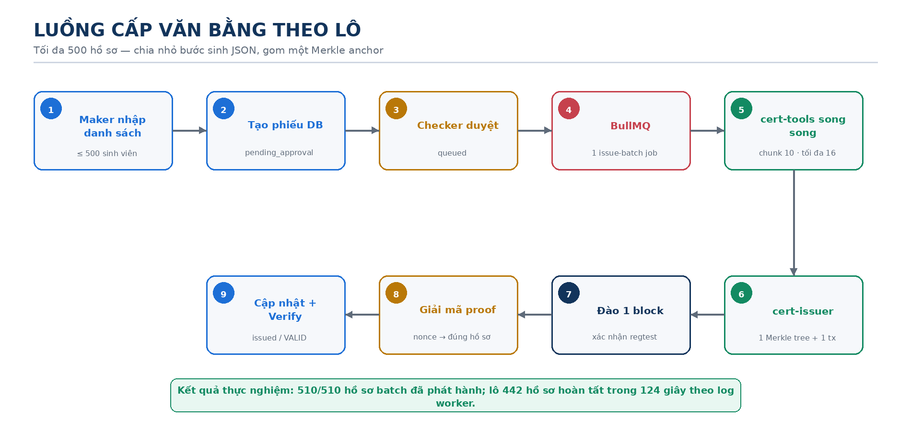

Workspace có roster, unsigned, blockchain certificate, issuer work và manifest. Dữ liệu runtime được giữ cục bộ và bị loại khỏi Git. Sau khi giải mã receipt, worker lưu `certUid`, `txid`, Merkle root và `batchId`; thao tác DB được chia nhỏ. Mỗi job hiện tối đa 500 hồ sơ, nên mục tiêu là một transaction mỗi job.

### 3.3.3. Cấu trúc chứng thư đầu ra

Chứng thư thực tế dùng context VC v1, Data Integrity v2 và Blockcerts v3.1; `type` gồm `VerifiableCredential` và `BlockcertsCredential`. Proof có `type=DataIntegrityProof`, `cryptosuite=merkle-proof-2019`, `proofPurpose=assertionMethod`, thời gian, verification method và `proofValue`. Cấu trúc được đối chiếu với VC, JSON-LD và Blockcerts [9], [11]–[14].

Nhiều chứng thư cùng `txid` là hành vi đúng của Merkle batching. Mỗi chứng thư có certificate ID, `certUid`, target hash và đường dẫn Merkle riêng; root chung mới được ghi trong `OP_RETURN`. SHA-256 là hàm băm nền theo FIPS 180-4 [4].

## 3.4. Hiện thực xác minh và thu hồi

### 3.4.1. Xác minh công khai

Verify portal gửi JSON đến `POST /api/verify`. Backend từ chối semantic không phù hợp, chuyển dữ liệu tới verifier service, nhận kết quả kiểm tra credential và adapter regtest. Adapter giải mã `proofValue`, lấy anchor, gọi RPC để đọc transaction, kiểm tra địa chỉ phát hành, `OP_RETURN`, Merkle root và ít nhất một confirmation. Sau đó backend tra thu hồi và lưu verification log/audit.

Kết quả `VALID` chỉ xuất hiện khi bằng chứng chứng thư và anchor đạt, đồng thời không bị thu hồi. `INVALID` phản ánh sai lệch được xác định; `REVOKED` phản ánh chứng thư hợp lệ nhưng mất hiệu lực; `INDETERMINATE` phản ánh không đủ dữ kiện để kết luận. Phân loại này quan trọng vì lỗi proof/tx không truy cập được không nên tự động bị diễn giải giống sửa payload.

### 3.4.2. Thu hồi

Chỉ Checker gọi được `POST /api/revoke/:id`. Service tạo `REVOKE:<certUid>`, mã hóa hex, tạo raw transaction với `OP_RETURN`, ký bằng `signrawtransactionwithkey`, broadcast và tạo một block. Việc ký trực tiếp bằng khóa được dùng vì ví regtest là watch-only. Khóa không nằm trong mã nguồn.

Sau khi giao dịch được xác nhận, PostgreSQL cập nhật `revoked`, transaction, actor, lý do và thời gian. Revocation List đọc các bản ghi này. Verify trước hết kiểm tra credential/anchor, sau đó trả `REVOKED` nếu DB ghi nhận thu hồi. Hình 3.4 mô tả luồng hai lớp.

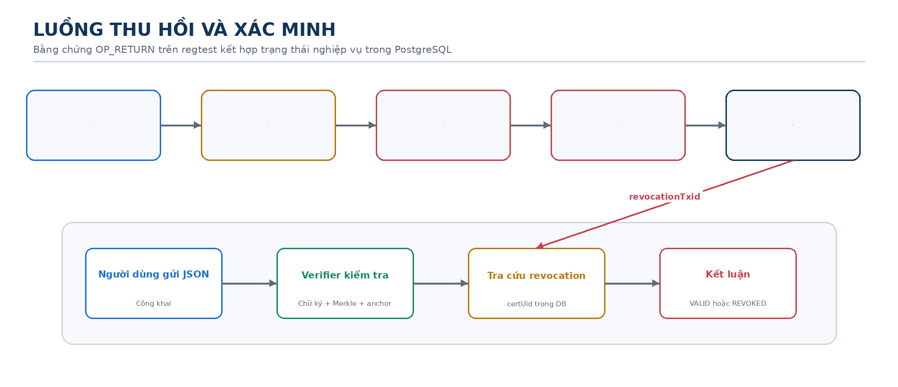

## 3.5. Hiện thực ba frontend

Cổng quản trị hiển thị dashboard, lập phiếu đơn/lô, duyệt nhiều phiếu, danh sách văn bằng, thu hồi, người dùng và audit. Menu được lọc theo Maker/Checker. Cổng Holder dùng tài khoản Student, lấy danh sách theo `recipientName`, cho xem/tải JSON và vẫn hiển thị bản ghi `revoked`. Cổng Verify không yêu cầu đăng nhập.

Một lỗi route đã được sửa bằng cách đặt `holder/certificates`, `batch/request`, `batch/approve` và `revoke/check` trước route tham số `:id`. Một lỗi khác xảy ra khi RolesGuard toàn cục chạy trước JWT strategy; giải pháp là gắn `AuthGuard('jwt')` và `RolesGuard` cục bộ đúng thứ tự. Các lỗi này được giữ trong nhật ký phát triển để giải thích quyết định thiết kế.

## 3.6. Hardening B12

Mật khẩu được băm bằng bcrypt với cost 10, đáp ứng mức tối thiểu cho bcrypt mà OWASP nêu; đối với hệ thống mới, Argon2id vẫn là lựa chọn được ưu tiên [17]. JWT tuân theo cấu trúc RFC 7519 [15]. RBAC từ chối Student ở cổng quản trị và kiểm tra quyền tại backend; actor được lấy từ JWT. B12 bổ sung Helmet, throttling, CORS allowlist, giới hạn kích thước body, cấu hình Swagger và Nginx. Nguyên tắc kiểm quyền trên mọi request phù hợp với hướng dẫn OWASP [16]. Verifier đã giới hạn một số URL và chặn `localhost`/`127.0.0.1`; tuy nhiên, đối chiếu mã nguồn với hướng dẫn phòng chống SSRF cho thấy biện pháp hiện tại chưa bao phủ đầy đủ các dải địa chỉ nội bộ IPv4/IPv6, địa chỉ metadata và DNS rebinding [23]. Vì vậy, đây mới là mức giảm thiểu ban đầu, không phải bằng chứng SSRF đã được xử lý triệt để.

Bản freeze R1 bị vô hiệu vì Nginx không có quyền ghi thư mục tạm cho request body lớn. Sau khi sửa quyền, preflight được chạy lại và đóng băng R2. Việc loại R1 khỏi thống kê nhưng lưu riêng bằng chứng lỗi giúp tránh lựa chọn dữ liệu có lợi và tăng khả năng truy vết.

## 3.7. Phương pháp kiểm thử

### 3.7.1. Mục tiêu và nguyên tắc

Kiểm thử trả lời ba câu hỏi: chứng thư bị sửa có bị phát hiện và Maker có bị chặn tự duyệt hay không; Merkle batching có phát hành đủ 10, 100 và 500 chứng thư với một transaction/lô hay không; thu hồi có đúng quyền, được xác nhận và phản ánh nhất quán ở Verify, Revocation List cùng audit hay không.

Bộ dữ liệu là dữ liệu giả lập, không dùng hồ sơ cá nhân thật. Mỗi kích thước hiệu năng lặp ba lần. Thời gian đo từ lúc Checker duyệt đến khi toàn bộ bản ghi `issued`. Artifacts gồm JSON thô, CSV, manifest, biểu đồ, trạng thái sau thử nghiệm và SHA-256 checksum. Lần chạy cấu hình sai được tách khỏi tập chính thức.

Thời gian mỗi chứng thư và throughput được tính:

`T_cert = T_batch / N`

`Throughput = N / T_batch`

Trong đó `T_batch` là thời gian từ duyệt đến phát hành hoàn tất, `N` là kích thước batch. Độ lệch chuẩn báo cáo là độ lệch chuẩn mẫu của ba lần lặp.

### 3.7.2. Kiểm thử tự động và chất lượng mã

Backend có 5 test suite với 8/8 test đạt: controller cơ bản; ba trường hợp RolesGuard; DTO phát hành; Issuer Profile/Revocation List; và semantic `credentialSubject.id`. Cả ba frontend build và lint thành công. `npm audit` của backend và ba frontend không phát hiện lỗ hổng tại thời điểm freeze. Kết quả audit dependency không đồng nghĩa hệ thống không có lỗ hổng logic hoặc cấu hình.

## 3.8. Kết quả Kịch bản 1 – tính toàn vẹn và Maker–Checker

Kịch bản bắt đầu từ chứng thư gốc hợp lệ, lần lượt sửa tên người nhận, tên văn bằng, `proofValue`, transaction id và thử để Maker tự duyệt. Sáu trên sáu ca đạt.

Bảng 3.2. Kết quả Kịch bản 1

| Mã | Ca kiểm thử | Kỳ vọng | Quan sát | Đánh giá |
|---|---|---|---|---|
| S1-01 | Chứng thư gốc | `VALID` | `VALID` | Đạt |
| S1-02 | Sửa tên người nhận | Không `VALID` | `INVALID` | Đạt |
| S1-03 | Sửa tên văn bằng | Không `VALID` | `INVALID` | Đạt |
| S1-04 | Sửa `proofValue` | Không `VALID` | `INDETERMINATE` | Đạt |
| S1-05 | Sửa txid trong proof | Không `VALID` | `INDETERMINATE` | Đạt |
| S1-06 | Maker tự duyệt | HTTP 403 | HTTP 403 | Đạt |

Hai trường hợp sửa nội dung trả `INVALID`; hai trường hợp phá bằng chứng/anchor trả `INDETERMINATE`. Cả bốn đều không bị nhận là `VALID`. Ca S1-06 cho thấy guard Maker–Checker đã chặn đúng hành vi tự duyệt trong phạm vi API và cấu hình được kiểm thử, không chỉ ở giao diện.

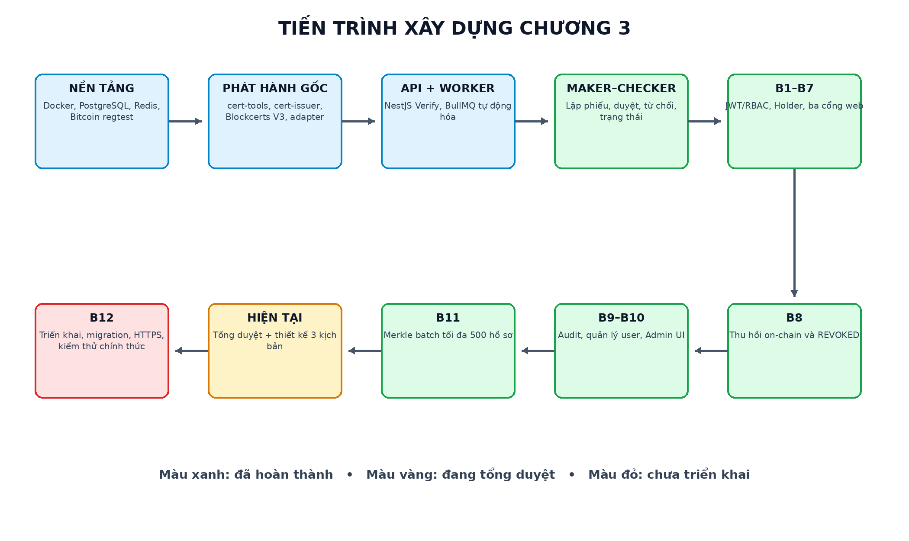

## 3.9. Kết quả Kịch bản 2 – hiệu năng Merkle batching

### 3.9.1. Kết quả từng lần

Bảng 3.3. Chín lần chạy hiệu năng chính thức

| Kích thước | Lần | Duyệt → issued (giây) | Giây/chứng thư | Chứng thư/giây | Thành công | Transaction |
|---:|---:|---:|---:|---:|---:|---:|
| 10 | 1 | 34,450 | 3,4450 | 0,2903 | 10/10 | 1 |
| 10 | 2 | 32,406 | 3,2406 | 0,3086 | 10/10 | 1 |
| 10 | 3 | 30,412 | 3,0412 | 0,3288 | 10/10 | 1 |
| 100 | 1 | 38,794 | 0,3879 | 2,5777 | 100/100 | 1 |
| 100 | 2 | 38,841 | 0,3884 | 2,5746 | 100/100 | 1 |
| 100 | 3 | 40,965 | 0,4097 | 2,4411 | 100/100 | 1 |
| 500 | 1 | 129,673 | 0,2593 | 3,8559 | 500/500 | 1 |
| 500 | 2 | 123,850 | 0,2477 | 4,0371 | 500/500 | 1 |
| 500 | 3 | 127,889 | 0,2558 | 3,9096 | 500/500 | 1 |

### 3.9.2. Giá trị tổng hợp

Bảng 3.4. Tổng hợp theo kích thước batch

| Batch | Số lần | Tổng chứng thư | Thành công | Thời gian TB ± SD (giây) | Giây/chứng thư TB | Throughput TB (chứng thư/giây) | Tx/batch |
|---:|---:|---:|---:|---:|---:|---:|---:|
| 10 | 3 | 30 | 100% | 32,423 ± 2,019 | 3,2423 | 0,3092 | 1,00 |
| 100 | 3 | 300 | 100% | 39,533 ± 1,240 | 0,3953 | 2,5311 | 1,00 |
| 500 | 3 | 1.500 | 100% | 127,137 ± 2,983 | 0,2543 | 3,9342 | 1,00 |

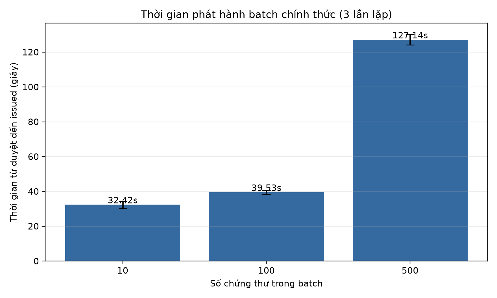

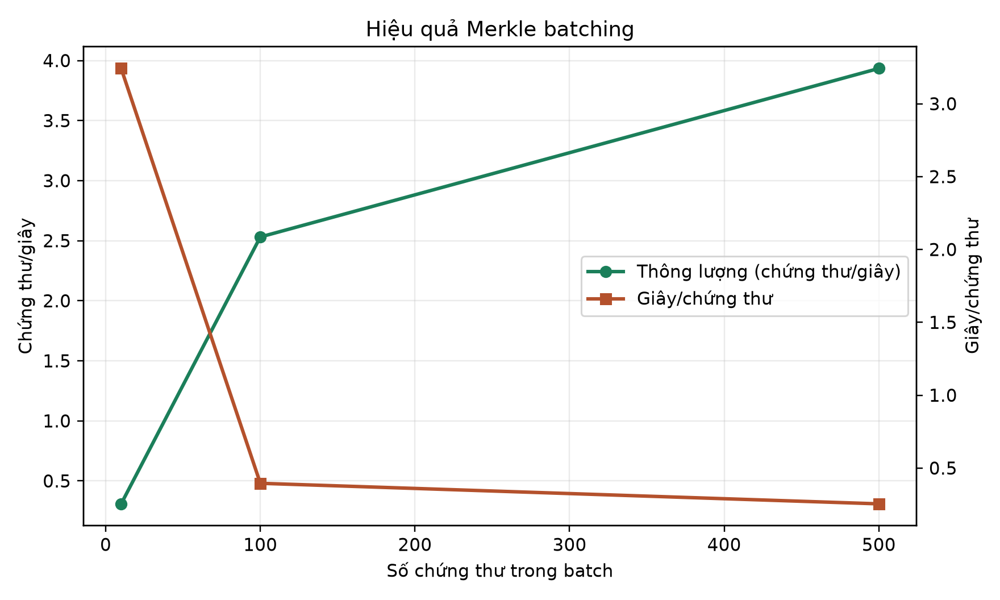

Khi batch tăng từ 10 lên 500, kích thước tăng 50 lần nhưng thời gian trung bình tăng khoảng 3,92 lần. Throughput tăng khoảng 12,72 lần; thời gian trung bình mỗi chứng thư giảm khoảng 92,16%. Kết quả phản ánh lợi ích phân bổ chi phí cố định và batching trong môi trường thử nghiệm, không phải cam kết hiệu năng production.

### 3.9.3. Tài nguyên

Bảng 3.5. Tài nguyên hệ thống

| Batch | CPU TB | CPU cực đại | Bộ nhớ dùng TB (MB) | Bộ nhớ cực đại TB (MB) | Backend RSS TB (MB) | Backend RSS cực đại TB (MB) |
|---:|---:|---:|---:|---:|---:|---:|
| 10 | 7,24% | 15,98% | 2.561,1 | 2.599,4 | 125,3 | 126,1 |
| 100 | 21,20% | 78,63% | 2.877,6 | 3.130,1 | 134,5 | 138,1 |
| 500 | 31,74% | 82,30% | 3.144,5 | 3.531,1 | 159,7 | 163,8 |

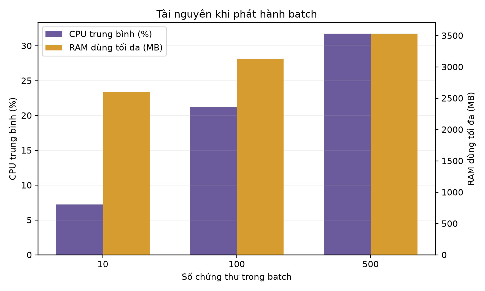

CPU và bộ nhớ tăng theo kích thước batch nhưng nằm trong giới hạn máy thử nghiệm. CPU cực đại khoảng 82,30% ở nhóm 500; bộ nhớ dùng cực đại trung bình khoảng 3.531,1 MB. Số liệu chỉ đại diện cấu hình 16 lõi và concurrency 16 đã nêu.

### 3.9.4. Kiểm toán artifact

Script kiểm toán ghi nhận 9/9 run đạt, 1.830/1.830 chứng thư được phát hành, 1.830 certificate ID duy nhất, 1.830/1.830 Merkle proof hợp lệ, 9 batch tương ứng 9 transaction và các transaction có confirmation. `SHA256SUMS_PUBLIC` kiểm tra 25/25 artifact được công bố; hai artifact nhạy cảm trong manifest nội bộ không nằm trong snapshot công khai.

Bảng 3.6. Kết quả kiểm toán

| Chỉ số | Kết quả |
|---|---:|
| Lần chạy | 9/9 đạt |
| Chứng thư | 1.830/1.830 |
| Certificate ID duy nhất | 1.830 |
| Merkle proof hợp lệ | 1.830/1.830 |
| Batch/transaction | 9/9 |
| Artifact checksum công khai | 25/25 |

Tổng 1.830 là tổng lượt/chứng thư của chín run: `3×10 + 3×100 + 3×500`. Không có việc cộng 1.830 chứng thư rồi nhân thêm ba lần; từng run sinh tập ID riêng.

## 3.10. Kết quả Kịch bản 3 – thu hồi, RBAC và audit

Bảng 3.7. Kết quả Kịch bản 3

| Mã | Ca kiểm thử | Kỳ vọng | Quan sát | Đánh giá |
|---|---|---|---|---|
| S3-01 | Trước thu hồi | `VALID` | `VALID` | Đạt |
| S3-02 | Student thu hồi | HTTP 403 | HTTP 403 | Đạt |
| S3-03 | Maker thu hồi | HTTP 403 | HTTP 403 | Đạt |
| S3-04 | Checker thu hồi | HTTP 201 | HTTP 201 | Đạt |
| S3-05 | Sau thu hồi | `REVOKED` | `REVOKED` | Đạt |
| S3-06 | Tx thu hồi xác nhận | ≥1 | 1 | Đạt |
| S3-07 | Có trong Revocation List | Có | Có | Đạt |
| S3-08 | Audit đủ role/action | 4 action | revoke/issue/approve/request | Đạt |

Tám trên tám ca đạt. Trong phạm vi môi trường R2 và các ca đã thiết kế, kết quả ghi nhận chỉ Checker thực hiện được thao tác thu hồi; transaction có xác nhận; Verify, Revocation List và audit trả kết quả nhất quán.

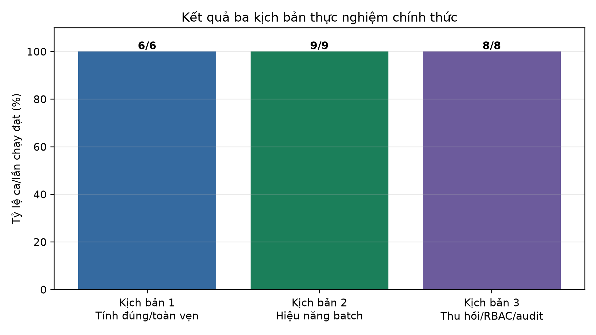

## 3.11. Đánh giá kết quả

### 3.11.1. Mức đáp ứng

Bảng 3.8. Đối chiếu yêu cầu và bằng chứng

| Yêu cầu | Bằng chứng | Kết quả |
|---|---|---|
| Maker không tự duyệt | S1-06 | Đạt |
| Phát hiện sửa chứng thư/bằng chứng | S1-02 đến S1-05 | Đạt |
| Phát hành 10/100/500 | 9 run, 1.830 chứng thư | Đạt |
| Một transaction mỗi batch | 9 batch/9 transaction | Đạt |
| Chỉ Checker thu hồi | S3-02 đến S3-04 | Đạt |
| Verify nhận biết thu hồi | S3-05 đến S3-07 | Đạt |
| Audit actor/action | S3-08 | Đạt |
| Build/test/health | 8/8 test; 3 frontend; `HEALTH_OK` | Đạt |

### 3.11.2. Hạn chế

Thứ nhất, regtest không phản ánh phí, độ trễ và kinh tế an ninh của mainnet. Thứ hai, thử nghiệm chạy trên một VPS và ba lần lặp mỗi kích thước; chưa đại diện tải dài hạn hoặc hệ thống phân tán nhiều node. Thứ ba, Student–chứng thư liên kết mềm bằng `recipientName`, có nguy cơ trùng tên. Thứ tư, khóa chưa ở HSM/KMS, chưa có MFA, HTTPS công khai, secret manager và quy trình xoay khóa.

Thứ năm, Revocation List dựa vào DB; chưa có indexer phục hồi từ blockchain. Thứ sáu, audit DB có thể bị quản trị viên hạ tầng sửa. Thứ bảy, test đơn vị còn ít, chưa bao phủ sâu worker, lỗi RPC, mất kết nối giữa thao tác Bitcoin và cập nhật DB. Thứ tám, lớp chống SSRF của verifier mới chặn một số trường hợp cơ bản, chưa xử lý đầy đủ địa chỉ nội bộ, metadata endpoint và DNS rebinding [23]. Thứ chín, khả năng tương tác với verifier Blockcerts bên ngoài regtest cần tiếp tục đánh giá.

### 3.11.3. Hướng phát triển

Cần dùng `studentCode` và khóa ngoại ổn định; tách bảng request/batch/certificate; bổ sung transactional outbox và idempotency; xây indexer thu hồi; đưa khóa vào HSM/KMS; thêm MFA, HTTPS/HSTS, backup/restore, giám sát và kiểm thử xâm nhập. Verifier cần phân giải DNS có kiểm soát, từ chối toàn bộ địa chỉ private/link-local/loopback/metadata sau mỗi lần phân giải và sau chuyển hướng, đồng thời chỉ cho phép hostname/scheme/port đã định trước theo khuyến nghị OWASP [23]. Trước mainnet cần kiểm thử testnet, xác định phí, confirmation policy, quyền riêng tư và trách nhiệm pháp lý. Có thể bổ sung verifier độc lập phía người dùng để giảm phụ thuộc dịch vụ trung tâm.

## 3.12. Kết luận Chương 3

Chương 3 đã trình bày môi trường, cách hiện thực backend, ba frontend, worker, Blockcerts toolchain, xác minh, thu hồi và hardening B12; đồng thời báo cáo kết quả thực nghiệm có artifact kiểm toán. Kịch bản 1 đạt 6/6, Kịch bản 2 có 9/9 run và 1.830/1.830 proof hợp lệ, Kịch bản 3 đạt 8/8. Kết quả cung cấp bằng chứng thực nghiệm rằng nguyên mẫu đáp ứng các yêu cầu đã kiểm thử và batching hoạt động trong môi trường regtest; kết quả không xác nhận tính đúng toàn diện và không được suy rộng thành mức sẵn sàng production.

# KẾT LUẬN VÀ KIẾN NGHỊ

## 1. Kết quả của đồ án

Đồ án đã nghiên cứu cơ sở blockchain, hàm băm, chữ ký số, cây Merkle, cơ chế đồng thuận và mô hình Verifiable Credentials; từ đó phân tích, thiết kế và xây dựng nguyên mẫu quản lý văn bằng số dựa trên Blockcerts V3 và Bitcoin. Hệ thống có ba vai trò xác thực Maker–Checker–Student, một nhóm người xác minh công khai, ba cổng web, phát hành theo lô, holder portal, thu hồi và audit.

Về kỹ thuật, hệ thống chuẩn hóa và băm từng chứng thư, tạo cây Merkle, neo một root cho cả lô lên Bitcoin regtest và gắn proof riêng vào từng credential. Bộ xác minh tính lại payload hash, proof, anchor, confirmation và trạng thái thu hồi. Thực nghiệm chính thức hoàn thành 6/6 phép thử nghiệp vụ, 8/8 phép thử xác minh–thu hồi, chín lần benchmark không lỗi và kiểm toán thành công 1.830/1.830 chứng thư duy nhất.

Kết quả cho thấy mô hình phù hợp để minh họa cách blockchain tăng khả năng phát hiện sửa đổi và giảm phụ thuộc vào tra cứu thủ công. Tuy nhiên, blockchain không tự chứng minh dữ liệu đầu vào là đúng và không thay thế quản trị của cơ sở đào tạo. Giá trị của chứng thư vẫn phụ thuộc vào danh tính issuer, quy trình phê duyệt, bảo vệ khóa và khả năng vận hành dịch vụ.

## 2. Đóng góp chính

Đóng góp của đồ án gồm: (1) mô hình hóa quy trình phát hành văn bằng có phân tách Maker–Checker; (2) hiện thực Blockcerts V3 theo lô với Merkle proof và Bitcoin anchor; (3) xây ba cổng giao diện phù hợp ba nhóm người dùng; (4) kết hợp kiểm tra on-chain với trạng thái nghiệp vụ, thu hồi và audit; (5) cung cấp migration, scripts và artifacts để tái lập, kiểm toán kết quả.

## 3. Kiến nghị

Trước khi triển khai thực tế, cần đánh giá pháp lý và quy trình nghiệp vụ của cơ sở đào tạo; quản lý khóa bằng HSM/KMS; bổ sung chữ ký tổ chức; triển khai indexer và phục hồi dữ liệu thu hồi; tăng độ phủ kiểm thử; kiểm thử bảo mật độc lập; xây quy trình backup, giám sát, luân chuyển khóa và ứng cứu sự cố. Việc chuyển sang testnet/mainnet chỉ nên thực hiện sau khi các điều kiện này được đáp ứng và chi phí, quyền riêng tư cùng chính sách lưu trữ đã được phê duyệt.

# TÀI LIỆU THAM KHẢO

[1] D. Yaga, P. Mell, N. Roby, K. Scarfone, “Blockchain Technology Overview,” NISTIR 8202, National Institute of Standards and Technology, 2018. DOI: 10.6028/NIST.IR.8202. https://doi.org/10.6028/NIST.IR.8202.

[2] S. Nakamoto, “Bitcoin: A Peer-to-Peer Electronic Cash System,” 2008. https://bitcoin.org/bitcoin.pdf (truy cập ngày 13/09/2026).

[3] R. C. Merkle, “Secrecy, Authentication, and Public Key Systems,” doctoral dissertation, Stanford University, 1979.

[4] National Institute of Standards and Technology, “Secure Hash Standard (SHS),” FIPS PUB 180-4, 2015. DOI: 10.6028/NIST.FIPS.180-4. https://doi.org/10.6028/NIST.FIPS.180-4.

[5] National Institute of Standards and Technology, “Digital Signature Standard (DSS),” FIPS PUB 186-5, 2023. DOI: 10.6028/NIST.FIPS.186-5. https://doi.org/10.6028/NIST.FIPS.186-5.

[6] M. Castro, B. Liskov, “Practical Byzantine Fault Tolerance,” Proceedings of the Third Symposium on Operating Systems Design and Implementation, 1999, pp. 173–186. https://www.usenix.org/conference/osdi-99/practical-byzantine-fault-tolerance.

[7] D. Ongaro, J. Ousterhout, “In Search of an Understandable Consensus Algorithm,” 2014 USENIX Annual Technical Conference, 2014, pp. 305–319. https://www.usenix.org/conference/atc14/technical-sessions/presentation/ongaro.

[8] E. Androulaki và cộng sự, “Hyperledger Fabric: A Distributed Operating System for Permissioned Blockchains,” Proceedings of the Thirteenth EuroSys Conference, 2018. DOI: 10.1145/3190508.3190538. https://doi.org/10.1145/3190508.3190538.

[9] M. Sporny, D. Longley, D. Chadwick (biên tập), “Verifiable Credentials Data Model v2.0,” W3C Recommendation, 15/05/2025. https://www.w3.org/TR/vc-data-model-2.0/.

[10] T. T. A. Dinh, R. Liu, M. Zhang, G. Chen, B. C. Ooi, J. Wang, “Untangling Blockchain: A Data Processing View of Blockchain Systems,” IEEE Transactions on Knowledge and Data Engineering, vol. 30, no. 7, pp. 1366–1385, 2018. DOI: 10.1109/TKDE.2017.2781227.

[11] Blockcerts, “cert-schema: JSON schemas and context for Blockcerts,” commit 1e390ac, 31/07/2025. https://github.com/blockchain-certificates/cert-schema/tree/1e390ace91fb2b09518e45760168f344ef3a4409 (truy cập ngày 13/09/2026).

[12] D. Longley, G. Kellogg, M. Sporny, M. Lanthaler, P.-A. Champin, N. Lindström (biên tập), “JSON-LD 1.1,” W3C Recommendation, 16/07/2020. https://www.w3.org/TR/json-ld11/.

[13] M. Sporny, D. Longley (biên tập), “Verifiable Credential Data Integrity 1.0,” W3C Recommendation, 15/05/2025. https://www.w3.org/TR/vc-data-integrity/.

[14] Blockcerts, “jsonld-signatures-merkleproof2019: MerkleProof2019 suite,” commit 26a9c30, 25/08/2026. https://github.com/blockchain-certificates/jsonld-signatures-merkleproof2019/tree/26a9c3071355a9ccd83b0b90fc375a4d8cf1d4b8 (truy cập ngày 13/09/2026).

[15] M. Jones, J. Bradley, N. Sakimura, “JSON Web Token (JWT),” RFC 7519, Internet Engineering Task Force, 2015. https://www.rfc-editor.org/rfc/rfc7519.

[16] OWASP Foundation, “Authorization Cheat Sheet.” https://cheatsheetseries.owasp.org/cheatsheets/Authorization_Cheat_Sheet.html (truy cập ngày 13/09/2026).

[17] OWASP Foundation, “Password Storage Cheat Sheet.” https://cheatsheetseries.owasp.org/cheatsheets/Password_Storage_Cheat_Sheet.html (truy cập ngày 13/09/2026).

[18] Bitcoin Project, “Bitcoin Developer Guide — Testing Applications.” https://developer.bitcoin.org/examples/testing.html (truy cập ngày 13/09/2026).

[19] NestJS, “NestJS Documentation.” https://docs.nestjs.com/ (truy cập ngày 13/09/2026).

[20] PostgreSQL Global Development Group, “PostgreSQL 17 Documentation — Transactions.” https://www.postgresql.org/docs/17/tutorial-transactions.html (truy cập ngày 13/09/2026).

[21] BullMQ, “BullMQ Documentation.” https://docs.bullmq.io/ (truy cập ngày 13/09/2026).

[22] TypeORM, “TypeORM Documentation — Migrations and Transactions.” https://typeorm.io/docs/advanced-topics/migrations/; https://typeorm.io/docs/advanced-topics/transactions/ (truy cập ngày 13/09/2026).

[23] OWASP Foundation, “Server Side Request Forgery Prevention Cheat Sheet.” https://cheatsheetseries.owasp.org/cheatsheets/Server_Side_Request_Forgery_Prevention_Cheat_Sheet.html (truy cập ngày 13/09/2026).

# PHỤ LỤC

## Phụ lục A. Nhóm API chính

| Nhóm | Đường dẫn tiêu biểu | Quyền |
|---|---|---|
| Xác thực | `POST /api/auth/login`, `GET /api/auth/me` | Công khai/đã đăng nhập |
| Tài khoản | `/api/admin/users` | Checker |
| Phát hành | `/api/issue/*` | Maker/Checker theo hành động |
| Holder | `/api/issue/holder/certificates` | Student |
| Xác minh | `/api/verify` | Công khai |
| Thu hồi | `/api/revoke/:id` | Checker |
| Issuer | `/api/blockcerts/issuers/kma/*` | Công khai |
| Audit | `/api/audit` | Maker, Checker |
| Health | `/health` | Công khai |

## Phụ lục B. Bằng chứng thực nghiệm chính thức

Bộ kết quả chính thức nằm trong `experiments/results/`, gồm tóm tắt kịch bản 1 và 3, chín kết quả benchmark, bảng tổng hợp hiệu năng, kiểm toán artifact, biểu đồ và `SHA256SUMS`. Freeze dùng cho báo cáo là `experiments/freeze/b12-freeze-r2.json`. Dữ liệu credential, private key, WIF, token, mật khẩu và tài khoản bootstrap không thuộc phạm vi công khai.

## Phụ lục C. Hướng dẫn tái lập tóm tắt

1. Tạo biến môi trường từ `.env.example` và thay toàn bộ giá trị bí mật.
2. Khởi động PostgreSQL, Redis và Bitcoin Core regtest bằng Docker Compose.
3. Chạy migration của backend; tạo ví regtest và cấp coin thử nghiệm.
4. Build, khởi động backend/worker và ba frontend; chạy health check.
5. Tạo tài khoản thử nghiệm không chứa dữ liệu cá nhân thật.
6. Chạy preflight, đóng băng cấu hình và thực thi các kịch bản.
7. Kiểm toán Merkle proof, tạo checksum và chỉ công bố artifact đã khử dữ liệu nhạy cảm.
