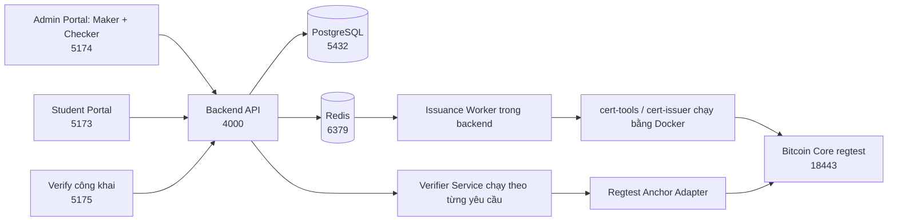

# Hệ thống xác thực văn bằng số dựa trên Blockcerts V3

Đồ án xây dựng hệ thống phát hành, quản lý, xác minh và thu hồi văn bằng số theo chuẩn **Blockcerts V3**. Dữ liệu chứng thư được gom theo lô, tạo **Merkle tree**, sau đó neo Merkle root lên Bitcoin bằng `OP_RETURN`.

> **Phạm vi hiện tại:** nguyên mẫu nghiên cứu chạy trên **Bitcoin regtest**. Repository này phù hợp để học tập, trình diễn và tái dựng thí nghiệm; chưa được tuyên bố là hệ thống production/mainnet.

---

## 1. Hệ thống giải quyết bài toán gì?

Hệ thống tách ba nhóm người dùng:

| Vai trò | Chức năng chính |
|---|---|
| **Maker** | Tạo yêu cầu phát hành, nhập danh sách sinh viên và gửi yêu cầu cho Checker |
| **Checker** | Kiểm tra, phê duyệt hoặc từ chối yêu cầu; quản lý người dùng, cấu hình đơn vị cấp và thu hồi chứng thư |
| **Student** | Đăng nhập cổng sinh viên, xem và tải chứng thư thuộc về mình |
| **Khách công khai** | Xác minh chứng thư mà không cần đăng nhập |

Hệ thống **không có vai trò Admin riêng**. Các nghiệp vụ quản trị thuộc quyền Checker.

### Nguyên tắc Maker–Checker

Maker không được tự phê duyệt yêu cầu do chính mình tạo. Chỉ Checker mới có quyền đưa yêu cầu đã gửi sang hàng đợi phát hành. Cơ chế này giúp tách người tạo dữ liệu khỏi người kiểm soát dữ liệu.

### Một giao dịch cho nhiều chứng thư

Mỗi chứng thư có `targetHash` và Merkle proof riêng. Các chứng thư trong cùng một lô dùng chung một Merkle root và một giao dịch Bitcoin, nhờ đó giảm số giao dịch cần tạo mà vẫn xác minh độc lập từng chứng thư.

---

## 2. Kiến trúc tổng quan



### Thành phần chính

- `backend/`: NestJS API, JWT/RBAC, Maker–Checker, hàng đợi BullMQ, audit và nghiệp vụ phát hành/thu hồi.
- `frontend-admin/`: một cổng quản trị dùng chung cho Maker và Checker; chức năng hiển thị theo RBAC.
- `frontend-client/`: cổng Student/Holder.
- `frontend-verify/`: cổng xác minh công khai.
- `apps/verifier-service/`: điều phối xác minh chứng thư Blockcerts.
- `adapters/regtest-anchor-adapter/`: kiểm tra Bitcoin anchor trong regtest.
- `blockcerts/`: cấu hình `cert-tools` và `cert-issuer`.
- `database/`: migration SQL.
- `experiments/`: script, kết quả và manifest đóng băng của thực nghiệm.
- `deploy/`: mẫu cấu hình Nginx và systemd.
- `docs/`: tài liệu cài đặt, vận hành, API, dữ liệu và kiểm thử.

---

## 3. Yêu cầu môi trường

### Bắt buộc

- Linux 64-bit; Ubuntu 22.04 hoặc mới hơn được khuyến nghị.
- Git.
- Node.js **22 LTS** và npm.
- Docker Engine.
- Docker Compose V2, dùng được lệnh `docker compose`.
- `curl` và `openssl`.

### Khuyến nghị

- RAM tối thiểu 8 GB.
- Còn trống tối thiểu 15 GB.
- Người dùng hiện tại có quyền chạy Docker.
- Dùng Chrome/Chromium hoặc Firefox bản mới.

Kiểm tra nhanh:

```bash
git --version
node --version
npm --version
docker --version
docker compose version
```

> Không dùng Node.js quá cũ. Các script trong repository sử dụng cú pháp JavaScript hiện đại và đã được xây dựng với Node.js 22.

---

## 4. Các cổng mặc định

| Dịch vụ | Cổng | Địa chỉ mặc định |
|---|---:|---|
| Backend API | 4000 | `http://127.0.0.1:4000` |
| Swagger | 4000 | `http://127.0.0.1:4000/docs` |
| Student Portal | 5173 | `http://127.0.0.1:5173` |
| Admin Portal (Maker/Checker) | 5174 | `http://127.0.0.1:5174` |
| Verify công khai | 5175 | `http://127.0.0.1:5175` |
| PostgreSQL | 5432 | nội bộ/phục vụ phát triển |
| Redis | 6379 | nội bộ/phục vụ phát triển |
| Bitcoin JSON-RPC | 18443 | regtest |
| Nginx mẫu | 8088 | `http://<máy-chủ>:8088` |

Nếu cổng đã bị chiếm, hãy dừng tiến trình đang dùng cổng hoặc sửa đồng bộ `.env`, cấu hình Vite và reverse proxy.

---

## 5. Bắt đầu nhanh cho người mới

Phần này giúp chạy API và ba giao diện trên máy cá nhân. Luồng **phát hành lên regtest** cần thêm khóa phát hành và được hướng dẫn riêng ở mục 8.

### Bước 1 — Clone repository

```bash
git clone https://github.com/ebkk24/DATN-AT190226.git
cd DATN-AT190226-release
```

### Bước 2 — Tạo tệp cấu hình

```bash
cp .env.example .env
chmod 600 .env
```

Mở `.env` và thay toàn bộ giá trị `CHANGE_ME` hoặc placeholder. Có thể sinh secret ngẫu nhiên bằng:

```bash
openssl rand -base64 48
```

Các biến tối thiểu phải kiểm tra:

```dotenv
POSTGRES_USER=blockcerts
POSTGRES_PASSWORD=<mật-khẩu-mạnh>
POSTGRES_DB=blockcerts
POSTGRES_HOST=127.0.0.1
POSTGRES_PORT=5432

REDIS_HOST=127.0.0.1
REDIS_PORT=6379

JWT_SECRET=<secret-ngẫu-nhiên-tối-thiểu-32-byte>

REDIS_PASSWORD=<mật-khẩu-Redis-mạnh>

BITCOIN_RPC_USER=<tài-khoản-rpc>
BITCOIN_RPC_PASSWORD=<mật-khẩu-rpc-mạnh>
BITCOIN_RPC_URL=http://127.0.0.1:18443
ISSUING_ADDRESS=<địa-chỉ-P2PKH-regtest>

HOST=127.0.0.1
PORT=4000
DATN_ROOT=/đường/dẫn/tuyệt/đối/tới/DATN-AT190226
PUBLIC_BASE_URL=http://127.0.0.1:4000
CORS_ORIGINS=http://127.0.0.1:5173,http://127.0.0.1:5174,http://127.0.0.1:5175
THROTTLE_TTL_MS=60000
THROTTLE_LIMIT=120

LOCAL_UID=<kết-quả-id-u>
LOCAL_GID=<kết-quả-id-g>
```

Lưu ý:

- `JWT_SECRET` phải là chuỗi ngẫu nhiên đủ mạnh, tối thiểu 32 byte.
- `DATN_ROOT` phải là đường dẫn tuyệt đối tới thư mục repository.
- Không commit `.env`.
- Không dùng credential mẫu trong môi trường thật.
- `PUBLIC_BASE_URL` phải là URL mà trình duyệt và Verifier Service đều truy cập được nếu muốn chạy đầy đủ luồng phát hành/xác minh. `127.0.0.1` chỉ phù hợp để bắt đầu API trên cùng máy.
- `CORS_ORIGINS` là danh sách origin được phép, phân tách bằng dấu phẩy; không thêm dấu `/` cuối URL.
- `THROTTLE_TTL_MS` và `THROTTLE_LIMIT` giới hạn số request trong một cửa sổ thời gian. Giá trị mẫu là 120 request/60 giây.
- Lấy `LOCAL_UID` và `LOCAL_GID` bằng `id -u` và `id -g`; chúng giúp container công cụ tạo tệp đúng chủ sở hữu trên Linux.

### Bước 3 — Khởi động hạ tầng

```bash
docker compose up -d postgres redis bitcoin-core
docker compose ps
```

Xem log nếu một container chưa ở trạng thái chạy:

```bash
docker compose logs --tail=100 postgres redis bitcoin-core
```

### Bước 4 — Cài dependency

```bash
cd backend && npm ci && cd ..
cd frontend-admin && npm ci && cd ..
cd frontend-client && npm ci && cd ..
cd frontend-verify && npm ci && cd ..
```

`npm ci` cài đúng phiên bản đã khóa trong `package-lock.json`. Không nên dùng `npm install` nếu chỉ muốn tái dựng môi trường hiện có.

### Bước 5 — Chạy migration cơ sở dữ liệu

```bash
cd backend
npm run migration:run
cd ..
```

Migration tạo schema và các bảng cần thiết, nhưng **không tạo sẵn tài khoản đăng nhập**.

### Bước 6 — Chạy backend

Mở terminal thứ nhất:

```bash
cd backend
npm run start:dev
```

Kiểm tra:

```bash
curl http://127.0.0.1:4000/health
```

Swagger nằm tại:

```text
http://127.0.0.1:4000/docs
```

### Bước 7 — Tạo tài khoản thử nghiệm ban đầu

Giữ backend đang chạy, mở terminal khác tại thư mục gốc:

```bash
node experiments/scripts/prepare-accounts.mjs
```

Script tạo các tài khoản thử nghiệm Maker, Checker và Student qua API. Thông tin nhạy cảm được lưu cục bộ trong:

```text
experiments/private/current-accounts.json
```

Kết quả kiểm toán không chứa mật khẩu nằm tại:

```text
experiments/results/account-bootstrap.json
```

Bảo vệ tệp credential:

```bash
chmod 600 experiments/private/current-accounts.json
```

> Không commit, chụp màn hình, đưa vào báo cáo hoặc gửi tệp `current-accounts.json` cho người khác. Thư mục `experiments/private/` đã được loại khỏi Git nhưng vẫn cần tự bảo vệ trên máy.

Mỗi lần chạy tạo một bộ username mới theo thời gian. Không chạy lặp lại nếu không cần, vì các tài khoản cũ vẫn còn trong cơ sở dữ liệu.

Script cũng ghi metadata không chứa mật khẩu vào `experiments/results/account-bootstrap.json`. Tệp này và thư mục `experiments/private/` đã được `.gitignore` loại khỏi snapshot công khai, vì vậy không dùng chúng làm artifact chính thức mới và không ép thêm bằng `git add -f`.

### Bước 8 — Chạy ba giao diện

Mở ba terminal riêng.

Admin Portal dành cho Maker và Checker:

```bash
cd frontend-admin
npm run dev
```

Student Portal:

```bash
cd frontend-client
npm run dev
```

Verify công khai:

```bash
cd frontend-verify
npm run dev
```

Truy cập:

- Student: `http://127.0.0.1:5173`
- Admin Portal cho Maker/Checker: `http://127.0.0.1:5174`
- Verify công khai: `http://127.0.0.1:5175`

---

## 6. Thiết lập biến môi trường cho frontend

Mặc định các frontend phát triển gọi backend tại `http://127.0.0.1:4000/api`. Khi backend nằm trên máy khác, tạo `.env.local` trong từng frontend:

```dotenv
VITE_API_URL=http://<địa-chỉ-backend>:4000
```

Tạo cho cả ba thư mục:

```text
frontend-admin/.env.local
frontend-client/.env.local
frontend-verify/.env.local
```

Sau khi sửa biến Vite, phải dừng và chạy lại `npm run dev`.

Trong triển khai qua Nginx, có thể dùng đường dẫn tương đối:

```dotenv
VITE_API_URL=https://<tên-miền-hoặc-host>
```

---

## 7. Luồng sử dụng cơ bản

### 7.1. Maker tạo yêu cầu phát hành

1. Đăng nhập Maker Portal.
2. Tạo yêu cầu mới.
3. Nhập thông tin văn bằng và danh sách người nhận.
4. Kiểm tra dữ liệu.
5. Gửi yêu cầu sang Checker.

Yêu cầu sau khi gửi không nên được coi là đã phát hành. Nó chỉ đang chờ kiểm soát.

### 7.2. Checker kiểm tra và phê duyệt

1. Đăng nhập Checker Portal.
2. Mở yêu cầu đang chờ duyệt.
3. Đối chiếu thông tin văn bằng và người nhận.
4. Chọn phê duyệt hoặc từ chối.
5. Nếu phê duyệt, backend đưa job vào Redis để worker xử lý.

Các trạng thái thường gặp:

- `pending_approval`: yêu cầu đang chờ Checker.
- `queued`: Checker đã duyệt và job đang chờ worker.
- `processing`: worker đang tạo và neo chứng thư.
- `issued`: phát hành thành công.
- `failed`: phát hành lỗi, cần xem log trước khi thử lại.
- `rejected`: Checker từ chối.
- `revoked`: chứng thư đã bị thu hồi.

Tên trạng thái hiển thị có thể được Việt hóa trên giao diện; giá trị API giữ nguyên theo contract.

### 7.3. Student xem chứng thư

1. Đăng nhập Student Portal bằng tài khoản Student đã được liên kết.
2. Xem danh sách chứng thư thuộc về mình.
3. Mở chi tiết hoặc tải JSON chứng thư.

Backend chỉ trả chứng thư khớp danh tính người nhận của Student; Student không được xem chứng thư của người khác.

### 7.4. Xác minh công khai

1. Mở trang `/verify` của Maker Portal.
2. Tải lên tệp chứng thư JSON hoặc cung cấp dữ liệu theo giao diện.
3. Hệ thống kiểm tra chữ ký/nội dung, Merkle proof, Bitcoin anchor và trạng thái thu hồi.
4. Đọc kết quả:
   - `VALID`: hợp lệ trong phạm vi bộ xác minh.
   - `INVALID`: dữ liệu/proof/anchor không hợp lệ.
   - `REVOKED`: chứng thư đã bị thu hồi.
   - `INDETERMINATE`: chưa đủ dữ liệu hoặc dịch vụ phụ trợ gặp lỗi; không được hiểu là hợp lệ.

### 7.5. Thu hồi chứng thư

Checker chọn chứng thư, nhập lý do thu hồi và xác nhận. Hệ thống lưu trạng thái thu hồi và ghi audit. Thu hồi không xóa giao dịch Bitcoin cũ; verifier phải kiểm tra thêm trạng thái thu hồi hiện tại.

---

## 8. Bật luồng phát hành Blockcerts trên Bitcoin regtest

### Cảnh báo quan trọng

Repository **không chứa private key/WIF**. Đây là chủ ý bảo mật. Chỉ sao chép `.env` và khởi động dịch vụ chưa đủ để phát hành chứng thư.

Các tệp mẫu trong `blockcerts/` chứa địa chỉ của môi trường thí nghiệm đã đóng băng. Khi dựng môi trường mới, phải tạo địa chỉ phát hành mới và cập nhật đồng bộ cấu hình.

### 8.1. Tạo ví và địa chỉ phát hành mới

Nạp biến môi trường vào shell:

```bash
set -a
source .env
set +a
```

Tạo hàm gọi Bitcoin CLI:

```bash
btc() {
  docker compose exec -T bitcoin-core \
    /opt/bitcoin-31.1/bin/bitcoin-cli \
    -regtest \
    -rpcuser="$BITCOIN_RPC_USER" \
    -rpcpassword="$BITCOIN_RPC_PASSWORD" \
    "$@"
}
```

Tạo ví legacy có private key:

```bash
btc -named createwallet \
  wallet_name=blockcerts_issuer \
  disable_private_keys=false \
  blank=false \
  descriptors=false \
  load_on_startup=true
```

Tạo địa chỉ và đào block để có UTXO đã trưởng thành:

```bash
ISSUING_ADDRESS="$(btc -rpcwallet=blockcerts_issuer getnewaddress issuer legacy)"
btc generatetoaddress 101 "$ISSUING_ADDRESS"
printf '%s\n' "$ISSUING_ADDRESS"
```

Xuất WIF vào tệp cục bộ được bảo vệ:

```bash
mkdir -p storage/credentials
btc -rpcwallet=blockcerts_issuer dumpprivkey "$ISSUING_ADDRESS" \
  > storage/credentials/pk_issuer.txt
chmod 600 storage/credentials/pk_issuer.txt
```

Không in WIF ra terminal, không đưa WIF vào `.env`, README, báo cáo hoặc Git.

### 8.2. Đồng bộ địa chỉ và URL đơn vị cấp

Dùng **cùng một** `ISSUING_ADDRESS` trong:

- `blockcerts/issuer/issuing-address.txt`
- `blockcerts/issuer/profile.json`
- `blockcerts/cert-issuer/config/conf.ini`
- `blockcerts/cert-issuer/config/mock-preflight.ini`
- `blockcerts/cert-issuer/config/real-preflight.ini`
- `blockcerts/cert-issuer/config/real-preflight.py`
- `scripts/preflight-cert-issuer.sh`

Dùng **cùng một** `PUBLIC_BASE_URL` trong:

- `.env`
- `blockcerts/cert-tools/config/conf.ini`
- `blockcerts/cert-tools/certificate_templates/diploma-v3.json`
- `blockcerts/cert-issuer/config/conf.ini`
- `blockcerts/issuer/profile.json`
- `blockcerts/issuer/revocation-list.json`

Tìm toàn bộ giá trị mẫu còn sót:

```bash
grep -RInE 'bcrt1|100\.81\.|\[REDACTED\]' \
  .env blockcerts scripts \
  --exclude='pk_issuer.txt'
```

Chỉ tiếp tục khi mọi địa chỉ/URL đã đúng với môi trường mới.

> `PUBLIC_BASE_URL` phải truy cập được từ trình duyệt và từ container Verifier Service. Khi chạy Docker trên Linux, `127.0.0.1` bên trong container không phải máy host. Hãy dùng tên miền, địa chỉ LAN hoặc Tailscale ổn định và cấu hình `HOST=0.0.0.0` nếu cần cho phép truy cập từ bên ngoài. Chỉ mở cổng qua firewall cho mạng tin cậy.

### 8.3. Tạo watch-only wallet dùng cho cert-issuer

Sau khi cập nhật `scripts/setup-regtest-watch-wallet.sh` bằng địa chỉ mới:

```bash
bash scripts/setup-regtest-watch-wallet.sh
```

Kiểm tra số dư:

```bash
btc -rpcwallet=certissuer_watch getbalances
```

### 8.4. Build công cụ Blockcerts

```bash
docker compose --profile tools build cert-tools cert-issuer
```

Chạy kiểm tra trước phát hành:

```bash
bash scripts/preflight-cert-issuer.sh
```

Preflight phải đạt trước khi Checker phê duyệt batch. Nếu preflight báo sai địa chỉ, sai URL, thiếu WIF hoặc không có UTXO thì không nên bỏ qua lỗi.

### 8.5. Build bộ xác minh

```bash
docker compose --profile tools build verifier-service
```

Verifier Service trong repository không mở một cổng HTTP thường trực. Khi nhận `POST /api/verify`, backend ghi chứng thư vào tệp tạm rồi chạy container `verifier-service` theo từng yêu cầu. Regtest Anchor Adapter được đóng gói trong image và truy vấn Bitcoin Core qua mạng Docker.

Có thể kiểm tra image đã sẵn sàng bằng:

```bash
docker image inspect datn/verifier-service:0.1.0 >/dev/null
```

Để xem lỗi xác minh, theo dõi log backend; container verifier sẽ tự bị xóa sau khi hoàn thành vì backend dùng `docker compose run --rm`.

### 8.6. Kiểm tra sau phát hành

Sau khi batch hoàn tất:

- Có `txid` trong dữ liệu batch/chứng thư.
- Transaction tồn tại trên regtest.
- Chứng thư có Merkle proof.
- Trang Verify trả kết quả phù hợp.
- Student tải được chứng thư của mình.
- Audit log ghi nhận người tạo, người duyệt và sự kiện phát hành.

Có thể kiểm tra transaction:

```bash
btc getrawtransaction <TXID> true
```

---

## 9. Chạy kiểm thử và kiểm tra chất lượng

### Backend

```bash
cd backend
npm test -- --runInBand
npm run build
```

### Frontend Admin (Maker/Checker)

```bash
cd frontend-admin
npm run lint
npm run build
```

### Frontend Student

```bash
cd frontend-client
npm run lint
npm run build
```

### Frontend Verify

```bash
cd frontend-verify
npm run lint
npm run build
```

### Kiểm toán artifact thực nghiệm

```bash
node experiments/scripts/audit-performance-artifacts.mjs
```

Freeze chính thức dùng trong báo cáo:

```text
experiments/freeze/b12-freeze-r2.json
```

Checksum artifact:

```text
experiments/results/SHA256SUMS
```

Kiểm tra checksum từ thư mục gốc:

```bash
cd experiments/results
sha256sum -c SHA256SUMS
```

Một số artifact nhạy cảm của môi trường thực nghiệm không được phát hành trong snapshot sạch. Vì vậy, khi kiểm tra bản release, cần đối chiếu manifest và danh sách tệp hiện diện thay vì suy diễn rằng mọi artifact nội bộ đều được công bố.

> Test đạt chỉ chứng minh các tình huống đã được viết hoạt động trong lần chạy đó. Kết quả regtest và dữ liệu sinh phục vụ thí nghiệm không phải chứng nhận production-ready.

---

## 10. Triển khai sau Nginx và systemd

Tài liệu chi tiết:

- [Hướng dẫn triển khai](deploy/README.md)
- [Phát hành Blockcerts trên regtest](docs/installation/05-phat-hanh-regtest.md)

Quy trình tổng quát:

1. Build ba frontend bằng `npm run build`.
2. Sao chép hoặc trỏ Nginx đến các thư mục `dist/`.
3. Chạy backend bằng service systemd không đặc quyền.
4. Chạy PostgreSQL, Redis, Bitcoin Core và verifier bằng Docker.
5. Chỉ mở Nginx ra mạng; giữ PostgreSQL, Redis và Bitcoin RPC ở localhost/mạng nội bộ.
6. Cấu hình HTTPS nếu truy cập ngoài máy.
7. Kiểm tra health, đăng nhập và một luồng xác minh trước khi bàn giao.

Mẫu cấu hình nằm tại:

```text
deploy/nginx/blockcerts.conf
deploy/systemd/blockcerts-backend.service
```

Các tệp này là **mẫu**, cần thay đường dẫn, tên người dùng, domain và credential theo máy triển khai.

---

## 11. Xử lý lỗi thường gặp

### Backend không kết nối PostgreSQL

Kiểm tra:

```bash
docker compose ps postgres
docker compose logs --tail=100 postgres
grep -E '^POSTGRES_(HOST|PORT|USER|DB)=' .env
```

Đảm bảo mật khẩu trong `.env` giống mật khẩu container được tạo lần đầu. Nếu đã đổi mật khẩu sau khi volume tồn tại, Docker không tự cập nhật mật khẩu cũ trong database.

### Backend không kết nối Redis

```bash
docker compose ps redis
docker compose exec redis redis-cli --no-auth-warning -a "$REDIS_PASSWORD" ping
```

Kết quả mong đợi: `PONG`.

### Đăng nhập luôn thất bại

- Kiểm tra đã chạy migration.
- Kiểm tra đã chạy `prepare-accounts.mjs`.
- Dùng đúng portal tương ứng vai trò.
- Không suy đoán mật khẩu; đọc tệp credential cục bộ được script tạo.
- Kiểm tra thời gian hệ thống nếu JWT bị coi là hết hạn bất thường.

### Trình duyệt báo CORS

- Kiểm tra frontend đang chạy đúng cổng 5173, 5174 hoặc 5175.
- Kiểm tra `CORS_ORIGINS` trong `.env`.
- Không thêm `*` khi dùng credential/JWT.
- Khởi động lại backend sau khi đổi `.env`.

### Checker phê duyệt nhưng batch đứng ở `queued`

- Kiểm tra Redis.
- Kiểm tra backend worker còn chạy.
- Xem log backend.
- Kiểm tra Docker socket, image `cert-tools`/`cert-issuer`, WIF và UTXO.
- Không phê duyệt lại liên tục vì có thể tạo job trùng nếu chưa xác định nguyên nhân.

### Phát hành lỗi vì thiếu tiền

Kiểm tra watch wallet và UTXO đã trưởng thành. Trên regtest, coinbase cần đủ số block xác nhận trước khi chi tiêu.

```bash
btc -rpcwallet=certissuer_watch listunspent
```

### Verifier trả `INDETERMINATE`

- Kiểm tra Verifier Service và Regtest Anchor Adapter.
- Kiểm tra container có truy cập được `PUBLIC_BASE_URL`.
- Kiểm tra Bitcoin RPC.
- Kiểm tra issuer profile và revocation list trả HTTP 200.
- Không chuyển `INDETERMINATE` thành `VALID` ở giao diện.

### Không tải được issuer profile

```bash
curl "$PUBLIC_BASE_URL/api/blockcerts/issuers/kma/profile.json"
curl "$PUBLIC_BASE_URL/api/blockcerts/issuers/kma/revocation-list.json"
```

Nếu chạy trong container, thử cùng URL từ container để phát hiện lỗi DNS/routing.

### Cổng bị chiếm

```bash
ss -ltnp | grep -E ':4000|:5173|:5174|:5175|:5432|:6379|:18443'
```

Dừng dịch vụ cũ hoặc đổi cổng đồng bộ; không chỉ đổi một phía.

### Làm sạch môi trường phát triển

Dừng container nhưng giữ dữ liệu:

```bash
docker compose down
```

Xóa cả volume và toàn bộ dữ liệu thử nghiệm:

```bash
docker compose down -v
```

> Lệnh `down -v` xóa PostgreSQL và blockchain regtest hiện tại. Chỉ dùng khi chắc chắn không cần dữ liệu.

---

## 12. Bảo mật và quản lý secret

Tuyệt đối không commit:

- `.env`.
- JWT secret.
- Mật khẩu PostgreSQL/Redis/Bitcoin RPC.
- Private key hoặc WIF.
- `experiments/private/current-accounts.json`.
- Credential bootstrap.
- Dữ liệu sinh viên thật.
- File runtime trong `backend/.batch-work/`.

Trước khi commit:

```bash
git status --short
git diff --cached
git grep -nE '(BEGIN (RSA |EC |OPENSSH )?PRIVATE KEY|JWT_.*SECRET=.*|WIF|rpcpassword)'
```

Nếu secret từng được commit, xóa file ở commit mới là **chưa đủ**. Phải thu hồi/đổi secret, sau đó xử lý lịch sử Git theo quy trình của nhóm.

Khuyến nghị khi triển khai:

- Chạy backend bằng người dùng riêng, không dùng `root`.
- Giới hạn quyền đọc tệp WIF ở mức `600`.
- Không công khai PostgreSQL, Redis hoặc Bitcoin RPC.
- Dùng HTTPS.
- Giới hạn kích thước và loại dữ liệu upload.
- Bật rate limit, logging và giám sát.
- Backup PostgreSQL, tệp chứng thư và cấu hình; định kỳ thử khôi phục.
- Không dùng khóa regtest cho testnet hoặc mainnet.

---

## 13. Dữ liệu thực nghiệm và giới hạn kết luận

Bộ thực nghiệm chính thức được đóng băng bằng manifest `b12-frozen-20260912-r2`. Kết quả cung cấp bằng chứng cho pipeline Blockcerts/Merkle trong môi trường kiểm soát, bao gồm 1.830 chứng thư và 1.830 Merkle proof được script kiểm toán xác nhận.

Các giới hạn cần hiểu đúng:

- Dữ liệu được sinh/kiểm soát phục vụ thí nghiệm, không phải dữ liệu trường thật.
- Bitcoin regtest không phản ánh phí, thời gian xác nhận, reorg và điều kiện mainnet.
- Chưa có bằng chứng đầy đủ cho tải production, nhiều Checker duyệt đồng thời, crash recovery, retry/idempotency và kiểm thử xâm nhập.
- Freeze và SHA-256 chứng minh tính toàn vẹn của artifact sau khi chốt; không tự chứng minh dữ liệu đại diện cho mọi môi trường thực tế.

Cách diễn đạt phù hợp:

> Hệ thống được kiểm chứng trong phạm vi nguyên mẫu và kịch bản regtest đã công bố; chưa được chứng nhận sẵn sàng production.

---

## 14. Tài liệu tham khảo trong repository

- [Hướng dẫn phát hành trên regtest](docs/installation/05-phat-hanh-regtest.md)
- [Ghi chú triển khai Nginx/systemd](deploy/README.md)
- Swagger sau khi backend chạy: `http://127.0.0.1:4000/docs`
- Manifest snapshot: [`SNAPSHOT_MANIFEST.md`](SNAPSHOT_MANIFEST.md)
- Báo cáo kiểm tra toàn vẹn báo cáo: [`SHA256SUMS_BAO_CAO`](SHA256SUMS_BAO_CAO)

Báo cáo đồ án:

```text
Bao_cao_DATN_hoan_chinh.md
Bao_cao_DATN_hoan_chinh.docx
Bao_cao_DATN_hoan_chinh.pdf
```

---

## 15. Checklist trước khi trình diễn

- [ ] PostgreSQL, Redis và Bitcoin Core đang chạy.
- [ ] Migration đã hoàn tất.
- [ ] Backend health trả thành công.
- [ ] Đã tạo tài khoản Maker, Checker và Student.
- [ ] Ba frontend mở được và gọi đúng API.
- [ ] Maker không thể tự duyệt yêu cầu.
- [ ] Checker xem được yêu cầu chờ duyệt.
- [ ] WIF tồn tại cục bộ, quyền `600`, không nằm trong Git.
- [ ] Watch wallet có UTXO đã trưởng thành.
- [ ] Preflight cert-issuer đạt.
- [ ] Image Verifier Service đã build và backend gọi được Docker.
- [ ] Issuer profile và revocation list truy cập được.
- [ ] Có sẵn một chứng thư hợp lệ, một chứng thư bị sửa và một chứng thư bị thu hồi để demo.
- [ ] Đã kiểm tra log không chứa credential.
- [ ] Đã dự phòng phương án demo bằng artifact đã đóng băng nếu mạng/dịch vụ gặp lỗi.

---

## 16. Giấy phép và sử dụng

Repository được xây dựng phục vụ đồ án tốt nghiệp và mục đích nghiên cứu/học tập. Trước khi tái sử dụng trong môi trường thật, cần đánh giá lại giấy phép của các dependency, chính sách bảo vệ dữ liệu cá nhân, quy trình quản lý khóa, mô hình đe dọa và yêu cầu pháp lý của đơn vị cấp văn bằng.
